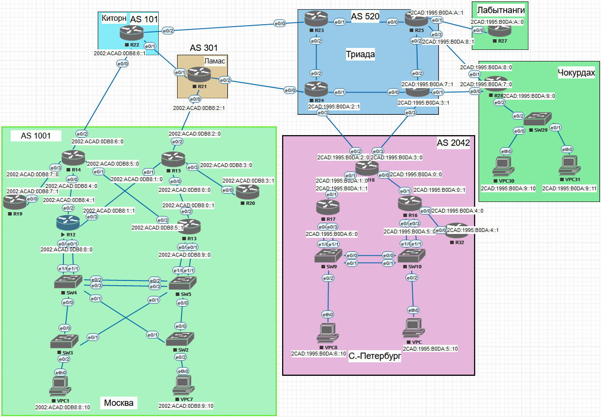

# IP адресация для Дипломной работы

## IPv4 на всю сеть

## Домашнее задание

IPv4/6

Цель: В данной самостоятельной работе необходимо распланировать адресное пространство Настроить IP на всех активных портах для дальнейшей работы над проектом Адресное пространство должно быть задокументировано

В этой  самостоятельной работе мы ожидаем, что вы самостоятельно:
 1. разработаете и задокументируете адресное пространство для лабораторного стенда.
 2. настроите ip адреса на каждом активном порту
 4. настроите каждый VPC в любом офисе в своем VLAN.
 5. настроите VLAN управления для сетевых устройств
 6. настроите сети офисов так, чтобы не возникало broadcast штормов, а использование линков было максимально оптимизировано
 7. используете ipv4 и ipv6

### **Наши провайдеры :** 

- **Китрон**
- **Ламас**
- **Триада**

| Устройстов | Port | IPv4              | Примечание      | Регион |
| ---------- | ---- | ----------------- | --------------- | ------ |
| R22        | e0/0 | 100.100.100.2/30  | R14(Msk)        | Киторн |
|            | e0/1 | 110.110.110.1/30  | R21(Lamas)      |        |
|            | e0/2 | 100.100.100.5/30  | R23(Triada)     |        |
| R21        | e0/0 | 111.111.111.2/30  | R15(Msk)        | Ламас  |
|            | e0/1 | 110.110.110.2/30  | R22(Kitorn)     |        |
|            | e0/2 | 111.111.111.5/30  | R24(Triada)     |        |
| R23        | e0/0 | 100.100.100.6/30  | R22(Kitorn)     | Триада |
|            | e0/1 | 10.10.30.5/30     | R25(Triada)     |        |
|            | e0/2 | 10.10.30.1/30     | R24(Triada)     |        |
| R24        | e0/0 | 111.111.111.6/30  | R21(Lamas)      |        |
|            | e0/1 | 10.10.30.13/30    | R26(Triada)     |        |
|            | e0/2 | 10.10.30.2/30     | R23(Triada)     |        |
|            | e0/3 | 111.111.111.9/30  | R18(Spb)        |        |
| R25        | e0/0 | 10.10.30.6/30     | R23(Triada)     |        |
|            | e0/1 | 210.110.35.1/30   | R27(Labytnangi) |        |
|            | e0/2 | 10.10.30.9/30     | R26(Triada)     |        |
|            | e0/3 | 235.110.35.9/30   | R28(Chukordah)  |        |
| R26        | e0/0 | 10.10.30. 14/30   | R24(Triada)     |        |
|            | e0/1 | 235.110.35.13/30  | R28(Chukordah)  |        |
|            | e0/2 | 10.10.30.10/30    | R25(Triada)     |        |
|            | e0/3 | 111.111.111.13/30 | R18(Spb)        |        |

### За Москву 

| Устройстов | Port | IPv4             | Примечание         | IP-Loopback | Регион |
| ---------- | ---- | ---------------- | ------------------ | ----------- | ------ |
| R15        | e0/0 | 10.10.10.5       | R13(local)         | 1.1.1.15/32 | МОСКВА |
|            | e0/1 | 10.10.10.9       | R12(local)         |             |        |
|            | e0/2 | 111.111.111.1/30 | R21(Lamas)         |             |        |
|            | e0/3 | 10.10.10.1       | R20(local)         |             |        |
| R14        | e0/0 | 10.10.10.17      | R12(local)         | 1.1.1.14/32 |        |
|            | e0/1 | 10.10.10.21      | R13(local)         |             |        |
|            | e0/2 | 100.100.100.1/30 | R22(Kitorn)        |             |        |
|            | e0/3 | 10.10.10.13      | R19(local)         |             |        |
| R13        | e0/0 | 172.16.1.2/24    | Agregation channel | 1.1.1.13/32 |        |
|            | e0/1 |                  | in SW5             |             |        |
|            | e0/2 | 10.10.10.6       | R15(local)         |             |        |
|            | e0/3 | 10.10.10.22      | R14(local)         |             |        |
| R12        | e0/0 | 172.16.0.1/24    | Agregation channel | 1.1.1.12/32 |        |
|            | e0/1 |                  | in SW4             |             |        |
|            | e0/2 | 10.10.10.18      | R14(local)         |             |        |
|            | e0/3 | 10.10.10.10      | R15(local)         |             |        |
| R19        | e0/0 | 10.10.10.14      | R14(local)         |             |        |
| R20        | e0/0 | 10.10.10.2       | R15(local)         |             |        |
| SW2        | e0/0 |                  |                    | 1.1.1.2/32  |        |
|            | e0/1 |                  |                    |             |        |
|            | e0/2 |                  |                    |             |        |
| SW3        | e0/0 |                  |                    | 1.1.1.3/32  |        |
|            | e0/1 |                  |                    |             |        |
|            | e0/2 |                  |                    |             |        |
| SW4        | e0/0 |                  |                    | 1.1.1.4/32  |        |
|            | e0/1 |                  |                    |             |        |
|            | e0/2 |                  |                    |             |        |
|            | e0/3 |                  |                    |             |        |
|            | e1/0 |                  |                    |             |        |
|            | e1/1 |                  |                    |             |        |
| SW5        | e0/0 |                  |                    | 1.1.1.5/32  |        |
|            | e0/1 |                  |                    |             |        |
|            | e0/2 |                  |                    |             |        |
|            | e0/3 |                  |                    |             |        |
|            | e1/0 |                  |                    |             |        |
|            | e1/1 |                  |                    |             |        |

### За Санкт-Петербург

| Устройств | Port | IPv4              | Примечание         | IP-Loopback | Регион       |
| --------- | ---- | ----------------- | ------------------ | ----------- | ------------ |
| R18       | e0/0 | 10.10.20.5        | R16(local)         | 1.1.2.18    | С.-Петербург |
|           | e0/1 | 10.10.20.1        | R17(local)         |             |              |
|           | e0/2 | 111.111.111.10/30 | R24(Triada)        |             |              |
|           | e0/3 | 111.111.111.14/30 | R26(Triada)        |             |              |
| R17       | e0/1 | 10.10.20.2        | R18(local)         | 1.1.2.17    |              |
|           | e0/2 | 172.16.10.1       | Agregation channel |             |              |
|           | e0/3 |                   | in SW9             |             |              |
| R16       | e0/0 | 10.10.20.9        | R32(local)         | 1.1.2.16    |              |
|           | e0/1 | 10.10.20.6        | R18(local)         |             |              |
|           | e0/2 | 172.16.11.1       | Agregation channel |             |              |
|           | e0/3 |                   | in SW10            |             |              |
| R32       | e0/0 | 10.10.20.10       | R16(local)         | 1.1.2.32    |              |
| SW10      | e0/0 |                   |                    | 1.1.2.10    |              |
|           | e0/1 |                   |                    |             |              |
|           | e0/2 |                   |                    |             |              |
|           | e0/3 |                   |                    |             |              |
|           | e1/0 |                   |                    |             |              |
| SW9       | e0/0 |                   |                    | 1.1.2.9     |              |
|           | e0/1 |                   |                    |             |              |
|           | e0/2 |                   |                    |             |              |
|           | e0/3 |                   |                    |             |              |
|           | e1/0 |                   |                    |             |              |

### За Чокурдах

| Устройств | Port | IPv4             | Примечание      | IP-Loopback | Регион   |
| --------- | ---- | ---------------- | --------------- | ----------- | -------- |
| R28       | e0/0 | 235.110.35.14/30 | R26(Triada)     | 1.1.3.28    | Чокурдах |
|           | e0/1 | 235.110.35.10/30 | R25(Triada)     |             |          |
|           | e0/2 | 172.16.40.1/24   | SW29(Chukordah) |             |          |
| SW29      | e0/0 |                  |                 | 1.1.3.29    |          |
|           | e0/1 |                  |                 |             |          |
|           | e0/2 |                  |                 |             |          |

### За Лабытнанги

| Устройств | Port | IPv4         | Примечание  | VLAN | Регион     |
| --------- | ---- | ------------ | ----------- | ---- | ---------- |
| R27       | e0/0 | 210.220.35.2 | R25(Triada) |      | Лабытнанги |

### Теперь коротко о резерве сети 

| МСК  | Сети       | Маска | Loopback   |
| ---- | ---------- | ----- | ---------- |
| P2P  | 10.10.10.0 | /24   | 1.1.1.0/24 |
| LN1  | 172.16.0.0 | /24   |            |
|      | 172.16.1.0 |       |            |

| Спб  | Сети        | Маска | Loopback   |
| ---- | ----------- | ----- | ---------- |
| P2P  | 10.10.20.0  | /24   | 1.1.2.0/24 |
| LN2  | 172.16.10.0 | /24   |            |
|      | 172.16.11.0 |       |            |

| Чокурдах | Сеть        | Маска | Loopback   |
| -------- | ----------- | ----- | ---------- |
| LN3      | 172.16.40.0 | /24   | 1.1.3.0/24 |

| Лабытнанги | Сеть       | Маска | Loopback   |
| ---------- | ---------- | ----- | ---------- |
| LN4        | 10.10.50.0 | /24   | 1.1.4.0/24 |

Как там устроено у провайдера, по большому счёту всё-равно . Он нам предоставляет выход в интернет и на том спасибо.)

## IPv6

За Москву

| Устройств | Port | IPv6                | Примечание         | Регион |
| --------- | ---- | ------------------- | ------------------ | ------ |
| R15       | e0/0 | 2002:ACAD:0DB8:0::0 | R13(local)         | МОСКВА |
|           | e0/1 | 2002:ACAD:0DB8:1::0 | R12(local)         |        |
|           | e0/2 | 2002:ACAD:0DB8:2::0 | R21(Lamas)         |        |
|           | e0/3 | 2002:ACAD:0DB8:3::0 | R20(local)         |        |
| R14       | e0/0 | 2002:ACAD:0DB8:4::0 | R12(local)         |        |
|           | e0/1 | 2002:ACAD:0DB8:5::0 | R13(local)         |        |
|           | e0/2 | 2002:ACAD:0DB8:6::0 | R22(Kitorn)        |        |
|           | e0/3 | 2002:ACAD:0DB8:7::0 | R19(local)         |        |
| R13       | e0/0 | 2002:ACAD:0DB8:8::0 | Agregation channel |        |
|           | e0/1 |                     | in SW5             |        |
|           | e0/2 | 2002:ACAD:0DB8:0::1 | R15(local)         |        |
|           | e0/3 | 2002:ACAD:0DB8:5::1 | R14(local)         |        |
| R12       | e0/0 | 2002:ACAD:0DB8:9::0 | Agregation channel |        |
|           | e0/1 |                     | in SW4             |        |
|           | e0/2 | 2002:ACAD:0DB8:4::1 | R14(local)         |        |
|           | e0/3 | 2002:ACAD:0DB8:1::1 | R15(local)         |        |
| R19       | e0/0 | 2002:ACAD:0DB8:7::1 | R14(local)         |        |
| R20       | e0/0 | 2002:ACAD:0DB8:3::1 | R15(local)         |        |
| SW2       | e0/0 | 2002:ACAD:0DB8:A::0 |                    |        |
|           | e0/1 |                     |                    |        |
|           | e0/2 |                     |                    |        |
| SW3       | e0/0 | 2002:ACAD:0DB8:B::0 |                    |        |
|           | e0/1 |                     |                    |        |
|           | e0/2 |                     |                    |        |
| SW4       | e0/0 | 2002:ACAD:0DB8:C::0 |                    |        |
|           | e0/1 |                     |                    |        |
|           | e0/2 |                     |                    |        |
|           | e0/3 |                     |                    |        |
|           | e1/0 |                     |                    |        |
|           | e1/1 |                     |                    |        |
| SW5       | e0/0 | 2002:ACAD:0DB8:D::0 |                    |        |
|           | e0/1 |                     |                    |        |
|           | e0/2 |                     |                    |        |
|           | e0/3 |                     |                    |        |
|           | e1/0 |                     |                    |        |
|           | e1/1 |                     |                    |        |

За Санкт-Петербург

| Устройств | Port | IPv6                | Примечание         | Регион       |
| --------- | ---- | ------------------- | ------------------ | ------------ |
| R18       | e0/0 | 2CAD:1995:B0DA:0::0 | R16(local)         | С.-Петербург |
|           | e0/1 | 2CAD:1995:B0DA:1::0 | R17(local)         |              |
|           | e0/2 | 2CAD:1995:B0DA:2::0 | R24(Triada)        |              |
|           | e0/3 | 2CAD:1995:B0DA:3::0 | R26(Triada)        |              |
| R17       | e0/1 | 2CAD:1995:B0DA:1::1 | R18(local)         |              |
|           | e0/2 |                     | Agregation channel |              |
|           | e0/3 |                     | in SW9             |              |
| R16       | e0/0 | 2CAD:1995:B0DA:4::0 | R32(local)         |              |
|           | e0/1 | 2CAD:1995:B0DA:0::1 | R18(local)         |              |
|           | e0/2 | 2CAD:1995:B0DA:5::0 | Agregation channel |              |
|           | e0/3 |                     | in SW10            |              |
| R32       | e0/0 | 2CAD:1995:B0DA:4::1 | R16(local)         |              |
| SW10      | e0/0 | 2CAD:1995:B0DA:B::0 |                    |              |
|           | e0/1 |                     |                    |              |
|           | e0/2 |                     |                    |              |
|           | e0/3 |                     |                    |              |
|           | e1/0 |                     |                    |              |
| SW9       | e0/0 | 2CAD:1995:B0DA:C::0 |                    |              |
|           | e0/1 |                     |                    |              |
|           | e0/2 |                     |                    |              |
|           | e0/3 |                     |                    |              |
|           | e1/0 |                     |                    |              |

Так как Триада является провайдером для 3х наших сетей,то пул адресов будет одинаковым

| Устройств | Port | IPv6                | Примечание  | Регион     |
| --------- | ---- | ------------------- | ----------- | ---------- |
| R27       | e0/0 | 2CAD:1995:B0DA:A::0 | R25(Triada) | Лабытнанги |

| Устройств | Port | IPv4                | Примечание      | Регион   |
| --------- | ---- | ------------------- | --------------- | -------- |
| R28       | e0/0 | 2CAD:1995:B0DA:7::0 | R26(Triada)     | Чокурдах |
|           | e0/1 | 2CAD:1995:B0DA:8::0 | R25(Triada)     |          |
|           | e0/2 | 2CAD:1995:B0DA:9::0 | SW29(Chukordah) |          |
| SW29      |      | 2CAD:1995:B0DA:D::0 |                 |          |

Подытожим : 

- 2002:ACAD:0DB8::/48 этот пул адресов нам выдал Ламас 
- 2CAD:1995:B0DA::/48 этот пул выдан был Триадой

 

###  VLAN

| City       | VLAN | Other      |
| ---------- | ---- | ---------- |
| Msk        | 10   | Native     |
|            | 11   | Native     |
|            | 99   | Management |
| Spb        | 12   | Native     |
|            | 13   | Native     |
|            | 98   | Management |
| Labytnangi | 14   | Native     |
|            | 97   | Management |
| Chukordah  | 15   | Native     |
|            | 96   | Management |