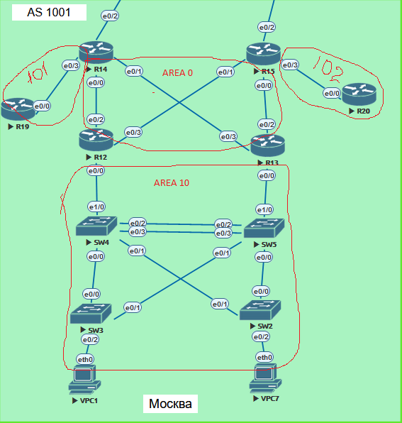

# Различные виды фильтрации в протоколе OSPF

## Домашнее задание

### OSPF

Цель: Настроить OSPF офисе Москва Разделить сеть на зоны Настроить фильтрацию между зонами

1. Маршрутизаторы R14-R15 находятся в зоне 0 - backbone
2. **Маршрутизаторы R12-R13 находятся в зоне 10. Дополнительно к маршрутам должны получать маршрут по-умолчанию**
3. Маршрутизатор R19 находится в зоне 101 и получает только маршрут по умолчанию
4. Маршрутизатор R20 находится в зоне 102 и получает все маршруты, кроме маршрутов до сетей зоны 1015
5. План работы и изменения зафиксированы в документации



### Маршрутизаторы R14-R15 находятся в зоне 0 - backbone


Так как у меня слетела схема и заглючила EVE-NG , то буду настраивать заново Со всеми настройками.

R14

```
enable
conf t
hos R14
ipv6 unic
int e0/0
ipv6 enable
ipv6 addr 2002:acad:db8:4::14/64
ip addr 10.10.10.17 255.255.255.252
no shut
int e0/1
ipv6 enable
ipv6 addr 2002:acad:db8:5::14/64
ip addr 10.10.10.21 255.255.255.252
no shut
int e0/2
ipv6 enable
ipv6 addr 2002:acad:db8:6::14/64
ip addr 100.100.100.1 255.255.255.252
no shut
int e0/3
ipv6 enable
ipv6 addr 2002:acad:db8:7::14/64
ip addr 10.10.10.13 255.255.255.252
no shut
no ip domain-lookup
line con 0
exec-t 0 0
exit

router ospf 1 
 router-id 14.14.14.14
 area 101 stub no-summary
 network 10.10.10.12 0.0.0.3 area 101
 network 10.10.10.16 0.0.0.3 area 0
 network 10.10.10.20 0.0.0.3 area 0

```

R15

```
enable
conf t
hos R15
ipv6 unic
int e0/0
ipv6 enable
ipv6 addr 2002:acad:db8:0::15/64
ip addr 10.10.10.5 255.255.255.252
no shut
int e0/1
ipv6 enable
ipv6 addr 2002:acad:db8:1::15/64
ip addr 10.10.10.9 255.255.255.252
no shut
int e0/2
ipv6 enable
ipv6 addr 2002:acad:db8:2::15/64
ip addr 111.111.111.1 255.255.255.252
no shut
int e0/3
ipv6 enable
ipv6 addr 2002:acad:db8:3::15/64
ip addr 10.10.10.1 255.255.255.252
no shut

router ospf 1
 router-id 15.15.15.15
 network 10.10.10.0 0.0.0.3 area 102
 network 10.10.10.4 0.0.0.3 area 0
 network 10.10.10.8 0.0.0.3 area 0
 distribute-list prefix PL1 in

ip prefix-list PL1 seq 5 deny 10.10.10.12/30
ip prefix-list PL1 seq 10 permit 0.0.0.0/0 le 32

```

### Маршрутизаторы R12-R13 находятся в зоне 10. Дополнительно к маршрутам должны получать маршрут по-умолчанию

R12

```
enable
conf t
hos R12
ipv6 unic
int e0/0
ip addr 172.16.0.1 255.255.255.0
no shut
ipv6 enable
ipv6 addr 2002:acad:db8:8::12/64
int e0/3
ip addr 10.10.10.10 255.255.255.252
no shut
ipv6 enable
ipv6 addr 2002:acad:db8:1::12/64
int e0/2
ip addr 10.10.10.18 255.255.255.252 
no shut
ipv6 enable 
ipv6 addr 2002:acad:db8:4::12/64

router ospf 1
 router-id 12.12.12.12
 network 10.10.10.8 0.0.0.3 area 0
 network 10.10.10.16 0.0.0.3 area 0
 network 172.16.0.0 0.0.0.255 area 10

```

R13

```
enable
conf t
hos R13
ipv6 unic
int e0/0
ipv6 enable
ipv6 addr 2002:acad:db8:9::13/64
ip addr 172.16.1.1 255.255.255.0
no shut
int e0/2
ipv6 enable
ipv6 addr 2002:acad:db8:0::13/64
ip addr 10.10.10.6 255.255.255.252
no shut
int e0/3
ipv6 enable
ipv6 addr 2002:acad:db8:5::13/64
ip addr 10.10.10.22 255.255.255.252
no shut

router ospf 1
 router-id 13.13.13.13
 network 10.10.10.4 0.0.0.3 area 0
 network 10.10.10.20 0.0.0.3 area 0
 network 172.16.1.0 0.0.0.255 area 10

```

**.............................................**

### Маршрутизатор R19 находится в зоне 101 и получает только маршрут по умолчанию

R19

```
enable
conf t
hos R19
ipv6 unic
int e0/0 
ip addr 10.10.10.14 255.255.255.252
ipv6 enable
ipv6 addr 2002:acad:db8:7::19/64
no shut

router ospf 1
 router-id 19.19.19.19
 area 101 stub
 network 10.10.10.12 0.0.0.3 area 101

```


```
R19#show ip route ospf
Codes: L - local, C - connected, S - static, R - RIP, M - mobile, B - BGP
       D - EIGRP, EX - EIGRP external, O - OSPF, IA - OSPF inter area
       N1 - OSPF NSSA external type 1, N2 - OSPF NSSA external type 2
       E1 - OSPF external type 1, E2 - OSPF external type 2
       i - IS-IS, su - IS-IS summary, L1 - IS-IS level-1, L2 - IS-IS level-2
       ia - IS-IS inter area, * - candidate default, U - per-user static route
       o - ODR, P - periodic downloaded static route, H - NHRP, l - LISP
       a - application route
       + - replicated route, % - next hop override

Gateway of last resort is 10.10.10.13 to network 0.0.0.0

O*IA  0.0.0.0/0 [110/11] via 10.10.10.13, 18:31:11, Ethernet0/0
```


### Маршрутизатор R20 находится в зоне 102 и получает все маршруты, кроме маршрутов до сетей зоны 101

R20

```
enable
conf t
hos R20
ipv6 unic
int e0/0 
ip addr 10.10.10.2 255.255.255.252
ipv6 enable
ipv6 addr 2002:acad:db8:3::20/64
no shut
no ip domain-loo
line con 0
exec-t 0 0

router ospf 1
 router-id 20.20.20.20
 network 10.10.10.0 0.0.0.3 area 102

```


```
R20#show ip route ospf
Codes: L - local, C - connected, S - static, R - RIP, M - mobile, B - BGP
       D - EIGRP, EX - EIGRP external, O - OSPF, IA - OSPF inter area
       N1 - OSPF NSSA external type 1, N2 - OSPF NSSA external type 2
       E1 - OSPF external type 1, E2 - OSPF external type 2
       i - IS-IS, su - IS-IS summary, L1 - IS-IS level-1, L2 - IS-IS level-2
       ia - IS-IS inter area, * - candidate default, U - per-user static route
       o - ODR, P - periodic downloaded static route, H - NHRP, l - LISP
       a - application route
       + - replicated route, % - next hop override

Gateway of last resort is not set

      10.0.0.0/8 is variably subnetted, 6 subnets, 2 masks
O IA     10.10.10.4/30 [110/20] via 10.10.10.1, 00:31:46, Ethernet0/0
O IA     10.10.10.8/30 [110/20] via 10.10.10.1, 00:31:46, Ethernet0/0
O IA     10.10.10.16/30 [110/30] via 10.10.10.1, 00:31:46, Ethernet0/0
O IA     10.10.10.20/30 [110/30] via 10.10.10.1, 00:31:46, Ethernet0/0
      172.16.0.0/24 is subnetted, 2 subnets
O IA     172.16.0.0 [110/30] via 10.10.10.1, 00:31:46, Ethernet0/0
O IA     172.16.1.0 [110/30] via 10.10.10.1, 00:31:46, Ethernet0/0
```

