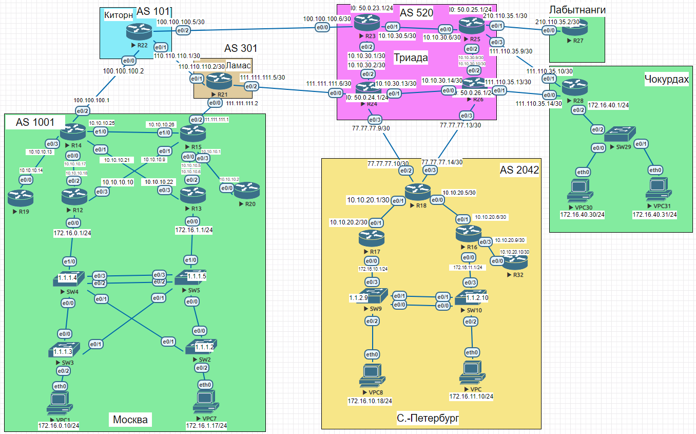

# Основные протоколы сети интернет 

## Домашнее задание

**Основные протоколы сети интернет**

Цель: Настроить DHCP в офисе Москва Настроить синхронизацию времени в офисе Москва Настроить NAT в офисе Москва, C.-Перетбруг и Чокурдах

В этой самостоятельной работе мы ожидаем, что вы самостоятельно:

1. Настроите NAT(PAT) на R14 и R15. Трансляция должна осуществляться в адрес автономной системы AS1001
2. Настроите NAT(PAT) на R18. Трансляция должна осуществляться в пул из 5 адресов автономной системы AS2042
3. Настроите статический NAT для R20
4. Настроите NAT так, чтобы R19 был доступен с любого узла для удаленного управления
5. Настроите статический NAT(PAT) для офиса Чокурдах
6. Настроите DHCP сервер в офисе Москва на маршрутизаторах R12 и R13. VPC1 и VPC7 должны получать сетевые настройки по DHCP
7. Настроите NTP сервер на R12 и R13. Все устройства в офисе Москва должны синхронизировать время с R12 и R13
8. Все офисы в лабораторной работе должны иметь IP связность
9. План работы и изменения зафиксированы в документации




### Настроите NAT(PAT) на R14 и R15. Трансляция должна осуществляться в адрес автономной системы AS1001

R14

```
interface Ethernet0/0
 ip nat inside

interface Ethernet0/1
 ip nat inside

interface Ethernet0/2
 ip nat outside
 
interface Ethernet0/3
 ip nat inside

interface Ethernet1/0
 ip nat inside
 
 // указываем на какой ip будем транслировать внутренние ip адреса локальной сети:
ip nat pool OVRLD 200.20.20.14 200.20.20.14 netmask 255.255.252.0

// включаем PAT:
ip nat inside source list 10 pool OVRLD overload 

// указываем пул внутренних ip адресов, которые будем транслировать:
access-list 10 permit 10.10.10.0 0.0.0.31 

```

R15

```
interface Ethernet0/0
 ip nat inside

interface Ethernet0/1
 ip nat inside

interface Ethernet0/2
 ip nat outside
 
interface Ethernet0/3
 ip nat inside

interface Ethernet1/0
 ip nat inside
 
 // указываем на какой ip будем транслировать внутренние ip адреса локальной сети:
ip nat pool OVRLD 200.20.20.15 200.20.20.15 netmask 255.255.252.0

// включаем PAT:
ip nat inside source list 10 pool OVRLD overload 

// указываем пул внутренних ip адресов, которые будем транслировать:
access-list 10 permit 10.10.10.0 0.0.0.31 

```

### Настроите NAT(PAT) на R18. Трансляция должна осуществляться в пул из 5 адресов автономной системы AS2042

R18

```
//Смотрят в сторону ТРИАДА
interface Ethernet0/2
 ip nat outside
 
 interface Ethernet0/3
 ip nat outside
 
//Смотрят внутрь Локальной сети 
interface Ethernet0/1
 ip nat inside
 
 interface Ethernet0/0
 ip nat inside
 
// указываем на какой ip будем транслировать внутренние ip адреса локальной сети:
ip nat pool OVRLD 77.77.77.10 77.77.77.10 netmask 255.255.255.252
ip nat pool OVRLD1 77.77.77.14 77.77.77.14 netmask 255.255.255.252

//Вкл самого NAT
ip nat inside source list 10 pool OVRLD overload 
ip nat inside source list 11 pool OVRLD1 overload 

// указываем пул внутренних ip адресов, которые будем транслировать:
access-list 10 permit 10.10.20.0 0.0.0.3
access-list 10 permit 172.16.10.0 0.0.0.255

access-list 11 permit 10.10.20.4 0.0.0.3
access-list 11 permit 10.10.20.8 0.0.0.3
access-list 11 permit 172.16.11.0 0.0.0.255
```

Первая половина будет NAT за подсеть **77.77.77.8/30** другая за **77.77.77.12/30**

### Настроите статический NAT для R20

R15

```
interface Loopback15
 ip address 200.20.20.15 255.255.252.0

ip nat inside source static 1.1.1.20 200.20.20.20

router bgp 1001
 network 200.20.20.0 mask 255.255.252.0
 
```

R14

```
interface Loopback14
 ip address 200.20.20.14 255.255.252.0

 ip nat inside source static 1.1.1.20 200.20.20.20

router bgp 1001
  network 200.20.20.0 mask 255.255.252.0
```

Проверку в программе WireShark выполнил ,трафик sniffer смотрел на R20 на interface e0/0

Оставлю как есть и сейчас обосную почему:

```
У меня трафик ходит только через R15 . Я достиг данного эфекта на уровне протокола IGP(OSPF):
R14
router ospf 1
 default-information originate metric 20

R15
router ospf 1
 default-information originate metric
 
На уровне EGP(BGP)
Тут я конкретно указал,что все маршруты приходящие от соседа R21 я заведома буду ставить Local Preference 150 ,что  будет выигрывать у R14 . А R14 заранее рассказывает о плохом маршруте .

R15
router bgp 1001
 neighbor 111.111.111.2 route-map LP in

route-map LP permit 10
 set local-preference 150
 
 R14
 route-map SET-ASPATH permit 10
  set as-path prepend 1001 1001 1001

router bgp 1001
 neighbor 100.100.100.2 route-map SET-ASPATH out
 
 Проверим на 2х роутерах:

Лабытнанги
R27>traceroute 200.20.20.20
Type escape sequence to abort.
Tracing the route to 200.20.20.20
VRF info: (vrf in name/id, vrf out name/id)
  1 210.110.35.1 1 msec 0 msec 1 msec
  2 10.10.30.5 0 msec 0 msec 1 msec
  3 10.10.30.2 1 msec 1 msec 1 msec
  4 111.111.111.5 1 msec 1 msec 1 msec
  5 111.111.111.1 2 msec 2 msec 1 msec
  6 200.20.20.20 2 msec *  3 msec

Спб
R32>traceroute 200.20.20.20
Type escape sequence to abort.
Tracing the route to 200.20.20.20
VRF info: (vrf in name/id, vrf out name/id)
  1 10.10.20.9 0 msec 1 msec 0 msec
  2 10.10.20.5 1 msec 0 msec 1 msec
  3 77.77.77.13 [AS 520] 2 msec 1 msec 1 msec
  4 10.10.30.13 2 msec 1 msec 2 msec
  5 111.111.111.5 [AS 301] 1 msec 1 msec 1 msec
  6 111.111.111.1 [AS 301] 2 msec 1 msec 1 msec
  7 200.20.20.20 [AS 1001] 3 msec

```

Итог : При смерти R15 ,весь трафик автоматом будет попадать на R14 . Если и этого будет недостаточно ,то подниму HSRP на R14 / R15

### Настроите NAT так, чтобы R19 был доступен с любого узла для удаленного управления

 R15

```
interface Loopback15
 ip address 200.20.20.15 255.255.252.0

router bgp 1001
 network 200.20.20.0 mask 255.255.252.0

ip nat inside source static tcp 1.1.1.19 22 200.20.20.19 22 extendable

```

R14

```
interface Loopback14
 ip address 200.20.20.14 255.255.252.0

router bgp 1001
 	network 200.20.20.0 mask 255.255.252.0

ip nat inside source static tcp 1.1.1.19 22 200.20.20.19 22 extendable
```

R19

```
Hostname R19
ip domain-name Test
crypto key generate rsa
[Enter]
1024
line vty 0 4
transport input ssh
login local
username admin secret cisco
ip ssh version 2
enable secret cisco

interface Loopback19
 ip address 1.1.1.19 255.255.255.255
 
router ospf 1
 network 1.1.1.19 0.0.0.0 area 101

```

### Настроите статический NAT(PAT) для офиса Чокурдах

R28

```
interface ethernet 0/1
  ip nat outside

interface ethernet 0/0
  ip nat outside

interface ethernet 0/2
  ip nat inside

//Для реализации потребуется минимум 5 адресов 
-1 для сети
-1 для Loopback
-1 для бродкаста
-2 для static NAT
Минимальная маска 29

interface Loopback 28
 ip address 111.110.35.1 255.255.255.248

ip nat inside source static 172.16.40.30 111.110.35.5
ip nat inside source static 172.16.40.31 111.110.35.6
```

Этого мало для работы ,поэтому маршрут должен быть известен всем по BGP , а также пропишем статический маршрут для прилежащих устройств

R26 / R25

```
router bgp 520
 network 111.110.35.0 mask 255.255.255.248
 
ip route 111.110.35.0 255.255.255.248 111.110.35.14 (111.110.35.10 для R25)

-------------------------------------------
//Проверка работоспособности схемы

R25#ping 111.110.35.5
Type escape sequence to abort.
Sending 5, 100-byte ICMP Echos to 111.110.35.5, timeout is 2 seconds:
!!!!!
Success rate is 100 percent (5/5), round-trip min/avg/max = 1/1/2 ms
R25#ping 111.110.35.6
Type escape sequence to abort.
Sending 5, 100-byte ICMP Echos to 111.110.35.6, timeout is 2 seconds:
!!!!!
Success rate is 100 percent (5/5), round-trip min/avg/max = 1/1/3 ms
```

### Настроите DHCP сервер в офисе Москва на маршрутизаторах R12 и R13. VPC1 и VPC7 должны получать сетевые настройки по DHCP

R12

```
ip dhcp excluded-address 172.16.0.1
ip dhcp pool DHCP12
 network 172.16.0.0 255.255.255.0
 default-router 172.16.0.1
```

R13

```
ip dhcp excluded-address 172.16.1.1
ip dhcp pool DHCP13
 network 172.16.1.0 255.255.255.0
 default-router 172.16.1.1
```

Для выполнения работы я добавлял различные VLAN на Switch ,подробности работы смотрим в документации .

**Результат:**

VPC1

```
VPCS> dhcp -r
DDORA IP 172.16.0.2/24 GW 172.16.0.1
```

VPC7

```
VPCS> dhcp -r
DDORA IP 172.16.1.2/24 GW 172.16.1.1
```

### Настроите NTP сервер на R12 и R13. Все устройства в офисе Москва должны синхронизировать время с R12 и R13

Сначала настроим NTP сервера:

R13

```
interface Ethernet0/0.33
 encapsulation dot1Q 33
 ip address 1.2.1.253 255.255.255.0
 ip nat inside
 ip virtual-reassembly in
 standby version 2
 standby 0 ip 1.2.1.1
 standby 0 preempt
 ntp broadcast


interface Ethernet0/2
 ntp broadcast

interface Ethernet0/3
 ntp broadcast

ntp source Loopback13
ntp master 5
ntp update-calendar
```

R12

```
interface Ethernet0/0.33
 encapsulation dot1Q 33
 ip address 1.2.1.252 255.255.255.0
 ip nat inside
 ip virtual-reassembly in
 standby version 2
 standby 0 ip 1.2.1.1
 standby 0 preempt
 ntp broadcast

interface Ethernet0/2
 ntp broadcast

interface Ethernet0/3
 ntp broadcast

ntp source Loopback12
ntp master 5
ntp update-calendar
```

Потом настроим NTP клиентов:
R14

```
interface Ethernet0/0
 ntp broadcast client
!
interface Ethernet0/1
 ntp broadcast client

ntp server 1.1.1.12
ntp server 1.1.1.13

-----------------------------------------
R14#show ntp associations

  address         ref clock       st   when   poll reach  delay  offset   disp
* 10.10.10.18     127.127.1.1      5     44     64   376  1.000  -0.500  2.890
+~1.1.1.12        127.127.1.1      5    151    256   377  0.000   0.000  2.541
+~1.1.1.13        127.127.1.1      5     34     64   377  0.000   0.000  4.007
+ 10.10.10.22     127.127.1.1      5     34     64   376  0.000   0.000  2.902
 * sys.peer, # selected, + candidate, - outlyer, x falseticker, ~ configured

```

R15

```
interface Ethernet0/0
 ntp broadcast client
!
interface Ethernet0/1
 ntp broadcast client

ntp server 1.1.1.12
ntp server 1.1.1.13

-----------------------------------------
R15#show ntp associations

  address         ref clock       st   when   poll reach  delay  offset   disp
+~1.1.1.12        127.127.1.1      5    110    128   377  0.000   0.000  5.376
+~1.1.1.13        127.127.1.1      5     95    128   377  0.000   0.000  3.409
* 10.10.10.6      127.127.1.1      5     13     64   377  1.000   0.500  2.894
 * sys.peer, # selected, + candidate, - outlyer, x falseticker, ~ configured

```

R20

```
interface Ethernet0/0
 ntp broadcast client

ntp server 1.1.1.12
ntp server 1.1.1.13

-----------------------------------------
R20#show ntp associations

  address         ref clock       st   when   poll reach  delay  offset   disp
*~1.1.1.12        127.127.1.1      5    612   1024   377  1.000  -0.500  2.038
+~1.1.1.13        127.127.1.1      5    158   1024   377  0.000   0.000  2.046
 * sys.peer, # selected, + candidate, - outlyer, x falseticker, ~ configured
```

R19

```
interface Ethernet0/0
 ntp broadcast client

ntp server 1.1.1.12
ntp server 1.1.1.13

-----------------------------------------
R19#show ntp associations

  address         ref clock       st   when   poll reach  delay  offset   disp
*~1.1.1.12        127.127.1.1      5    810   1024   377  1.000  -0.500  2.008
+~1.1.1.13        127.127.1.1      5    613   1024   377  1.000  -0.500  1.974
 * sys.peer, # selected, + candidate, - outlyer, x falseticker, ~ configured
```

А теперь свичи:

SW2 / SW3 / SW4 / SW5

```
Для примера я взял SW4
------------------------------
//Заведем Vlan для управления 
Vlan 33
 name MANAGEMENT

interface Vlan33
 ip address 1.2.1.4 255.255.255.0
 ntp broadcast client
 
ip default-gateway 1.2.1.1

Не стал указывать сервер 1.1.1.12(13) ,так как свичи работают в единой канальной среде при работе с HSRP

Результат:
SW4#show ntp status
Clock is synchronized, stratum 6, reference is 1.2.1.252
nominal freq is 250.0000 Hz, actual freq is 250.0001 Hz, precision is 2**10
ntp uptime is 579100 (1/100 of seconds), resolution is 4000
reference time is E29A4D78.2353F830 (23:19:52.138 EET Sun Jun 21 2020)
clock offset is -0.5000 msec, root delay is 1.00 msec
root dispersion is 7.81 msec, peer dispersion is 2.90 msec
loopfilter state is 'CTRL' (Normal Controlled Loop), drift is -0.000000355 s/s
system poll interval is 64, last update was 59 sec ago.

-----------------------------------------------------------------------------
SW4#show ntp associations

  address         ref clock       st   when   poll reach  delay  offset   disp
* 1.2.1.252       127.127.1.1      5      8     64   377  1.000  -6.500  2.908
+ 1.2.1.253       127.127.1.1      5     43     64   377  1.000  -0.500  2.874
 * sys.peer, # selected, + candidate, - outlyer, x falseticker, ~ configured

```

Не стал растягивать из того большую ДЗ ,подробности настроек всегда можно заглянуть в документации


### Все офисы в лабораторной работе должны иметь IP связность

Проверяем с R15

```
R15>ping 210.110.35.2
Type escape sequence to abort.
Sending 5, 100-byte ICMP Echos to 210.110.35.2, timeout is 2 seconds:
!!!!!
Success rate is 100 percent (5/5), round-trip min/avg/max = 1/2/3 ms
R15>ping 111.110.35.10
Type escape sequence to abort.
Sending 5, 100-byte ICMP Echos to 111.110.35.10, timeout is 2 seconds:
!!!!!
Success rate is 100 percent (5/5), round-trip min/avg/max = 1/1/2 ms
R15>ping 111.110.35.14
Type escape sequence to abort.
Sending 5, 100-byte ICMP Echos to 111.110.35.14, timeout is 2 seconds:
!!!!!
Success rate is 100 percent (5/5), round-trip min/avg/max = 1/1/1 ms
R15>ping 77.77.77.10
Type escape sequence to abort.
Sending 5, 100-byte ICMP Echos to 77.77.77.10, timeout is 2 seconds:
!!!!!
Success rate is 100 percent (5/5), round-trip min/avg/max = 1/1/2 ms
R15>ping 77.77.77.14
Type escape sequence to abort.
Sending 5, 100-byte ICMP Echos to 77.77.77.14, timeout is 2 seconds:
!!!!!
Success rate is 100 percent (5/5), round-trip min/avg/max = 1/1/2 ms
```

### План работы и изменения зафиксированы в документации

**Для доступа к прописанным конфигурациям на роутерах ,то жмём сюда :**

https://e9exu-my.sharepoint.com/:f:/g/personal/nickelface_ermaon_com/Euh_hOXWUWRAr0awcVlpJVYBzobOZWNdcKt4VLkLif40EA?e=GGNmyl

