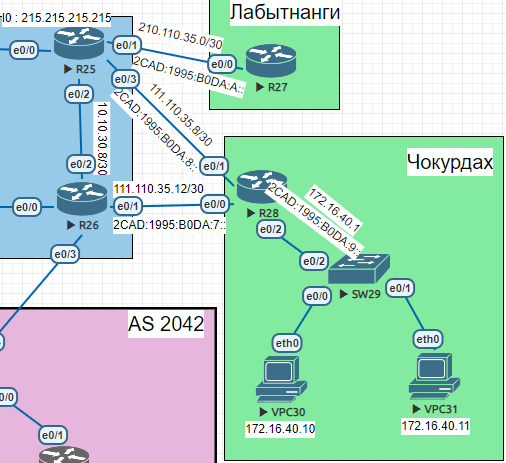

# Маршрутизация на основе политик (PBR)

## Домашнее задание

### PBR

Цель: Настроить политику маршрутизации в офисе Чокурдах Распределить трафик между 2 линками

  В этой  самостоятельной работе мы ожидаем, что вы самостоятельно:

1. Настроите политику маршрутизации для сетей офиса Чокурдах
2. Распределите трафик между двумя линками с провайдером в Чокурдах
3. Настроите отслеживание линка через технологию IP SLA в Чокурдах
4. Настройте для офиса Лабытнанги маршрут по-умолчанию
5. План работы и изменения зафиксированы в документации 



| Устройств | Port | IPv4             | IPv6                 | Примечание      | Регион     |
| --------- | ---- | ---------------- | -------------------- | --------------- | ---------- |
| R27       | e0/0 | 210.110.35.2/30  | 2CAD:1995:B0DA:A::27 | R25(Triada)     | Лабытнанги |
| R28       | e0/0 | 111.110.35.14/30 | 2CAD:1995:B0DA:7::28 | R26(Triada)     | Чокурдах   |
|           | e0/1 | 111.110.35.10/30 | 2CAD:1995:B0DA:8::28 | R25(Triada)     |            |
|           | e0/2 | 172.16.40.1/24   | 2CAD:1995:B0DA:9::28 | SW29(Chukordah) |            |
| VPC30     |      | 172.16.40.10     | 2cad:1995:b0da:9::10 |                 |            |
| VPC31     |      | 172.16.40.11     | 2cad:1995:b0da:9::11 |                 |            |

## Настроите политику маршрутизации для сетей офиса Чокурдах

**R28**

```
R28#show ipv6 int brief
Ethernet0/0            [up/up]
    FE80::A8BB:CCFF:FE01:C000
    2CAD:1995:B0DA:7::28
Ethernet0/1            [up/up]
    FE80::A8BB:CCFF:FE01:C010
    2CAD:1995:B0DA:8::28
Ethernet0/2            [up/up]
    FE80:21::28
    2CAD:1995:B0DA:9::28
    
R28#show ip int bri
Interface                  IP-Address      OK? Method Status                Protocol
Ethernet0/0                111.110.35.14   YES manual up                    up
Ethernet0/1                111.110.35.10   YES manual up                    up
Ethernet0/2                172.16.40.1     YES manual up                    up

```

Со стороны провайдера не вижу смысла показывать 

## Распределите трафик между двумя линками с провайдером в Чокурдах

**R28**

```
enbale
configure terminal

На R25  мы поднимаем Loopback сеть и указываем маршрут до них
А на стороне провайдера работает OSPF ,там я ничего не прописывал ,кроме анонса сети.
ip route 215.215.215.215 255.255.255.255 111.110.35.9


ip access-list extended ACL1
 permit ip host 172.16.40.10 any

route-map TEST permit 10
 match ip address ACL1
 set ip next-hop 111.110.35.13 
 set ipv6 next-hop 2CAD:1995:B0DA:7::26

 
interface Ethernet0/2
 ip policy route-map TEST

```

**VPC30**

```
До применения Route-map

VPCS> trace 215.215.215.215
trace to 215.215.215.215, 8 hops max, press Ctrl+C to stop
 1   172.16.40.1   0.551 ms  0.369 ms  0.357 ms
 2   *111.110.35.9   1.014 ms (ICMP type:3, code:3, Destination port unreachable)  *

После применения Route-map

VPCS> trace 215.215.215.215
trace to 215.215.215.215, 8 hops max, press Ctrl+C to stop
 1   172.16.40.1   0.629 ms  0.560 ms  0.463 ms
 2   111.110.35.13   0.902 ms  0.655 ms  0.590 ms
 3   *10.10.30.9   0.882 ms (ICMP type:3, code:3, Destination port unreachable)  *
```


## Настроите отслеживание линка через технологию IP SLA в Чокурдах

**R28**

```
ip sla 1
 icmp-echo 111.110.35.9 source-interface Ethernet0/1
 frequency 5
ip sla schedule 1 life forever start-time now
!
ip sla 2
 icmp-echo 111.110.35.13 source-interface Ethernet0/0
 frequency 5
ip sla schedule 2 life forever start-time now
!
track 1 ip sla 1 reachability
track 2 ip sla 2 reachability
!
ip route 0.0.0.0 0.0.0.0 111.110.35.9 track 1
ip route 0.0.0.0 0.0.0.0 111.110.35.13 track 2

------------------------------------------------------------------------------
Немного переделаем Route-map с проверкой

route-map TEST permit 10
 match ip address ACL1
 set ip next-hop verify-availability 111.110.35.9 10 track 1
 set ip next-hop verify-availability 111.110.35.13 15 track 2

```

Проверка Track и Route-map

```
R28#show track 1
Track 1
  IP SLA 1 reachability
  Reachability is Up
    13 changes, last change 00:40:47
  Latest operation return code: OK
  Latest RTT (millisecs) 1
  Tracked by:
    ROUTE-MAP 0
    STATIC-IP-ROUTING 0


R28#show track 2
Track 2
  IP SLA 2 reachability
  Reachability is Up
    7 changes, last change 01:09:14
  Latest operation return code: OK
  Latest RTT (millisecs) 1
  Tracked by:
    ROUTE-MAP 0
    STATIC-IP-ROUTING 0


R28#show route-map
route-map TEST, permit, sequence 10
  Match clauses:
    ip address (access-lists): ACL1
  Set clauses:
    ip next-hop verify-availability 111.110.35.9 10 track 1  [up]
    ip next-hop verify-availability 111.110.35.13 15 track 2  [up]
     ipv6 next-hop 2CAD:1995:B0DA:7::26
  Policy routing matches: 234 packets, 24284 bytes
```


## Настройте для офиса Лабытнанги маршрут по-умолчанию

**R27**

```
R27(config)#do sh run | s route
ip route 0.0.0.0 0.0.0.0 210.110.35.1
ipv6 route ::/0 2CAD:1995:B0DA:A::25
```


