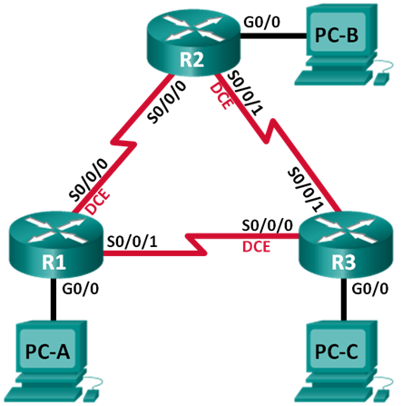

# Лабораторная работа. Базовая настройка протокола EIGRP для IPv4

## Топология



## Таблица адресации

| Устройство | Интерфейс    | IP-адрес    | Маска подсети   | Шлюз по умолчанию |
| ---------- | ------------ | ----------- | --------------- | ----------------- |
| R1         | G0/0         | 192.168.1.1 | 255.255.255.0   | —                 |
|            | S0/0/0 (DCE) | 10.1.1.1    | 255.255.255.252 | —                 |
|            | S0/0/1       | 10.3.3.1    | 255.255.255.252 | —                 |
| R2         | G0/0         | 192.168.2.1 | 255.255.255.0   | —                 |
|            | S0/0/0       | 10.1.1.2    | 255.255.255.252 | —                 |
|            | S0/0/1 (DCE) | 10.2.2.2    | 255.255.255.252 | —                 |
| R3         | G0/0         | 192.168.3.1 | 255.255.255.0   | —                 |
|            | S0/0/0 (DCE) | 10.3.3.2    | 255.255.255.252 | —                 |
|            | S0/0/1       | 10.2.2.1    | 255.255.255.252 | —                 |
| PC-A       | NIC          | 192.168.1.3 | 255.255.255.0   | 192.168.1.1       |
| PC-B       | NIC          | 192.168.2.3 | 255.255.255.0   | 192.168.2.1       |
| PC-C       | NIC          | 192.168.3.3 | 255.255.255.0   | 192.168.3.1       |

## Задачи

**Часть 1. Построение сети и проверка соединения**

**Часть 2. Настройка маршрутизации EIGRP**

**Часть 3. Проверка маршрутизации EIGRP**

**Часть 4. Настройка пропускной способности и пассивных интерфейсов**


##  Построение сети и проверка связи

R1

```
enable
configure terminal
hostname R1
interface Serial0/0
ip address 10.1.1.1 255.255.255.252
no shutdown
interface Serial1/0
ip address 10.3.3.1 255.255.255.252
no shutdown
interface GigabitEthernet2/0
ip address 192.168.1.1 255.255.255.0
no shutdown
line console 0
exec-timeout 0 0
exit
no ip domain-lookup
enable secret class
line vty 0 15
logging synchronous
password cisco
login
exit
Banner motd "This is a secure system. Authorized Access Only!"
do copy run start
[Enter]
```

R2

```
enable
configure terminal
hostname R2
interface Serial0/0
ip address 10.1.1.2 255.255.255.252
no shutdown
interface Serial1/0
ip address 10.2.2.2 255.255.255.252
no shutdown
interface GigabitEthernet2/0
ip address 192.168.2.1 255.255.255.0
no shutdown
line console 0
exec-timeout 0 0
exit
no ip domain-lookup
enable secret class
line vty 0 15
logging synchronous
password cisco
login
exit
Banner motd "This is a secure system. Authorized Access Only!"
do copy run start
[Enter]
```

R3

```
enable
configure terminal
hostname R2
interface Serial0/0
ip address 10.3.3.2 255.255.255.252
no shutdown
interface Serial1/0
ip address 10.2.2.1 255.255.255.252
no shutdown
interface GigabitEthernet2/0
ip address 192.168.3.1 255.255.255.0
no shutdown
line console 0
exec-timeout 0 0
exit
no ip domain-lookup
enable secret class
line vty 0 15
logging synchronous
password cisco
login
exit
Banner motd "This is a secure system. Authorized Access Only!"
do copy run start
[Enter]
```

### Проверьте подключение

Проверил все подключения, скриншоты нет смысла показывать, раздувать лабораторную в размерах.


## Настройка маршрутизации EIGRP

R1

```
router eigrp 10
network 10.1.1.0 0.0.0.3
network 192.168.1.0 0.0.0.255
network 10.3.3.0 0.0.0.3
```

R2

```
router eigrp 10
network 10.1.1.0 0.0.0.3
network 192.168.2.0 0.0.0.255
network 10.2.2.0 0.0.0.3
```

R3

```
router eigrp 10
network 10.2.2.0 0.0.0.3
network 192.168.3.0 0.0.0.255
network 10.3.3.0 0.0.0.3
```

Почему рекомендуется использовать шаблонные маски при объявлении сетей? 

Потому что Router OS не даст анонсировать обычную

Можно ли исключить маску в какой-нибудь из вышеприведённых инструкций network?
 Если да, то в какой (в каких)?

Да ,при явно анонсировании классовой сети 

## Проверка маршрутизации EIGRP

R1

```
R1(config-router)#do show ip eigrp neighbors
IP-EIGRP neighbors for process 10
H   Address         Interface      Hold Uptime    SRTT   RTO   Q   Seq
                                   (sec)          (ms)        Cnt  Num
0   10.1.1.2        Se0/0          11   00:32:24  40     1000  0   9
1   10.3.3.2        Se1/0          11   00:32:11  40     1000  0   14
```

R2

```
R2(config-router)#do show ip eigrp neighbors
IP-EIGRP neighbors for process 10
H   Address         Interface      Hold Uptime    SRTT   RTO   Q   Seq
                                   (sec)          (ms)        Cnt  Num
0   10.1.1.1        Se0/0          10   00:34:17  40     1000  0   9
1   10.2.2.1        Se1/0          11   00:34:04  40     1000  0   13
```

R3

```
R3(config)#do show ip eigrp neighbor
IP-EIGRP neighbors for process 10
H   Address         Interface      Hold Uptime    SRTT   RTO   Q   Seq
                                   (sec)          (ms)        Cnt  Num
0   10.2.2.2        Se1/0          11   00:35:19  40     1000  0   10
1   10.3.3.1        Se0/0          13   00:35:18  40     1000  0   10
```

###  Проанализируйте таблицу IP-маршрутизации EIGRP.

```
R1(config-router)#do show ip route eigrp
     10.0.0.0/8 is variably subnetted, 4 subnets, 2 masks
D       10.0.0.0/8 is a summary, 00:41:44, Null0
D       10.2.2.0/30 [90/21024000] via 10.1.1.2, 00:38:32, Serial0/0
                    [90/21024000] via 10.3.3.2, 00:38:19, Serial1/0
D    192.168.2.0/24 [90/20514560] via 10.1.1.2, 00:38:32, Serial0/0
D    192.168.3.0/24 [90/20514560] via 10.3.3.2, 00:38:19, Serial1/0
```

Почему у маршрутизатора R1 два пути к сети 10.2.2.0/30?
Метрика и АД совпадают,а значит оба включаются в таблицу за этот маршрут

### Проанализируйте таблицу соседних устройств EIGRP.

```
R1#show ip eigrp topology
IP-EIGRP Topology Table for AS 10/ID(192.168.1.1)

Codes: P - Passive, A - Active, U - Update, Q - Query, R - Reply,
       r - Reply status

P 10.0.0.0/8, 1 successors, FD is 20512000
         via Summary (20512000/0), Null0
P 10.1.1.0/30, 1 successors, FD is 20512000
         via Connected, Serial0/0
P 10.2.2.0/30, 2 successors, FD is 21024000
         via 10.1.1.2 (21024000/20512000), Serial0/0
         via 10.3.3.2 (21024000/20512000), Serial1/0
P 10.3.3.0/30, 1 successors, FD is 20512000
         via Connected, Serial1/0
P 192.168.1.0/24, 1 successors, FD is 5120
         via Connected, GigabitEthernet2/0
P 192.168.2.0/24, 1 successors, FD is 20514560
         via 10.1.1.2 (20514560/5120), Serial0/0
P 192.168.3.0/24, 1 successors, FD is 20514560
         via 10.3.3.2 (20514560/5120), Serial1/0
```

Почему в таблице топологии маршрутизатора R1 отсутствуют возможные преемники?

Потому что Feasible successor это резервный маршрутизатор с путем без петель (AD  feasible successor должно быть меньше чем FD текущего маршрута  successor). А такого маршрутизатора в данной топологии нет.

### Проверьте параметры маршрутизации EIGRP и объявленные сети

```
R1#show ip protocols

Routing Protocol is "eigrp  10 " 
  Outgoing update filter list for all interfaces is not set 
  Incoming update filter list for all interfaces is not set 
  Default networks flagged in outgoing updates  
  Default networks accepted from incoming updates 
  EIGRP metric weight K1=1, K2=0, K3=1, K4=0, K5=0
  EIGRP maximum hopcount 100
  EIGRP maximum metric variance 1
Redistributing: eigrp 10
  Automatic network summarization is in effect  
  Automatic address summarization: 
    10.0.0.0/8 for GigabitEthernet2/0
      Summarizing with metric 20512000
  Maximum path: 4
  Routing for Networks:  
     10.1.1.0/30
     192.168.1.0
     10.3.3.0/30
  Routing Information Sources:  
    Gateway         Distance      Last Update 
    10.1.1.2        90            3332124    
    10.3.3.2        90            3345257    
  Distance: internal 90 external 170
```

Какой номер автономной системы используется?

 10

Какие сети объявляются?   

10.1.1.0/30
192.168.1.0
10.3.3.0/30

Каково значение административной дистанции для маршрутов EIGRP?  

90

Сколько маршрутов с равной стоимостью по умолчанию использует EIGRP?  

2

## Настройка пропускной способности и пассивных интерфейсов

```
R1#show interface serial 0/0
Serial0/0 is up, line protocol is up (connected)
  Hardware is HD64570
  Internet address is 10.1.1.1/30
  MTU 1500 bytes, BW 128 Kbit, DLY 20000 usec,
     reliability 255/255, txload 1/255, rxload 1/255
  Encapsulation HDLC, loopback not set, keepalive set (10 sec)
  Last input never, output never, output hang never
  Last clearing of "show interface" counters never
  Input queue: 0/75/0 (size/max/drops); Total output drops: 0
  Queueing strategy: weighted fair
  Output queue: 0/1000/64/0 (size/max total/threshold/drops)
     Conversations  0/0/256 (active/max active/max total)
     Reserved Conversations 0/0 (allocated/max allocated)
     Available Bandwidth 96 kilobits/sec
  5 minute input rate 104 bits/sec, 0 packets/sec
  5 minute output rate 104 bits/sec, 0 packets/sec
     880 packets input, 52938 bytes, 0 no buffer
     Received 0 broadcasts, 0 runts, 0 giants, 0 throttles
     0 input errors, 0 CRC, 0 frame, 0 overrun, 0 ignored, 0 abort
     921 packets output, 55459 bytes, 0 underruns
     0 output errors, 0 collisions, 1 interface resets
     0 output buffer failures, 0 output buffers swapped out
     0 carrier transitions
     DCD=up  DSR=up  DTR=up  RTS=up  CTS=up
```

Какова пропускная способность по умолчанию для этого последовательного интерфейса? 

 128

Сколько маршрутов к сети 10.2.2.0/30 содержит таблица маршрутизации? 

2

```
R1#show ip route eigrp 
     10.0.0.0/8 is variably subnetted, 4 subnets, 2 masks
D       10.0.0.0/8 is a summary, 01:12:36, Null0
D       10.2.2.0/30 [90/21024000] via 10.1.1.2, 01:09:24, Serial0/0
                    [90/21024000] via 10.3.3.2, 01:09:11, Serial1/0
D    192.168.2.0/24 [90/20514560] via 10.1.1.2, 01:09:24, Serial0/0
D    192.168.3.0/24 [90/20514560] via 10.3.3.2, 01:09:11, Serial1/0
```

###  Измените пропускную способность на маршрутизаторах.

Поменяем пропускную способность R1

```
interface serial 0/0 
bandwidth 2000
interface serial 1/0
bandwidth 64
```

Посмотрим как поменялась таблица маршрутизации на R1

```
R1#show ip route 
Codes: C - connected, S - static, I - IGRP, R - RIP, M - mobile, B - BGP
       D - EIGRP, EX - EIGRP external, O - OSPF, IA - OSPF inter area
       N1 - OSPF NSSA external type 1, N2 - OSPF NSSA external type 2
       E1 - OSPF external type 1, E2 - OSPF external type 2, E - EGP
       i - IS-IS, L1 - IS-IS level-1, L2 - IS-IS level-2, ia - IS-IS inter area
       * - candidate default, U - per-user static route, o - ODR
       P - periodic downloaded static route

Gateway of last resort is not set

     10.0.0.0/8 is variably subnetted, 4 subnets, 2 masks
D       10.0.0.0/8 is a summary, 00:00:45, Null0
C       10.1.1.0/30 is directly connected, Serial0/0
D       10.2.2.0/30 [90/21024000] via 10.1.1.2, 00:00:42, Serial0/0
C       10.3.3.0/30 is directly connected, Serial1/0
C    192.168.1.0/24 is directly connected, GigabitEthernet2/0
D    192.168.2.0/24 [90/1794560] via 10.1.1.2, 00:00:42, Serial0/0
D    192.168.3.0/24 [90/21026560] via 10.1.1.2, 00:00:28, Serial0/0
```

Теперь до сети 10.2.2.0/30 только 1 маршрут. Поменяем и на остальных.

```
R2(config)# interface s0/0
R2(config-if)# bandwidth 2000
R2(config-if)# interface s1/0
R2(config-if)# bandwidth 2000

R3(config)# interface s0/0
R3(config-if)# bandwidth 64
R3(config-if)# interface s1/0
R3(config-if)# bandwidth 2000

```

###  Проверьте изменения пропускной способности.

```
R1#show interfaces serial 0/0
Serial0/0 is up, line protocol is up (connected)
  Hardware is HD64570
  Internet address is 10.1.1.1/30
  MTU 1500 bytes, BW 2000 Kbit, DLY 20000 usec,
     reliability 255/255, txload 1/255, rxload 1/255
  Encapsulation HDLC, loopback not set, keepalive set (10 sec)
  Last input never, output never, output hang never
  Last clearing of "show interface" counters never
  Input queue: 0/75/0 (size/max/drops); Total output drops: 0
  Queueing strategy: weighted fair
  Output queue: 0/1000/64/0 (size/max total/threshold/drops)
     Conversations  0/0/256 (active/max active/max total)
     Reserved Conversations 0/0 (allocated/max allocated)
     Available Bandwidth 1500 kilobits/sec
  5 minute input rate 109 bits/sec, 0 packets/sec
  5 minute output rate 105 bits/sec, 0 packets/sec
     1082 packets input, 65133 bytes, 0 no buffer
     Received 0 broadcasts, 0 runts, 0 giants, 0 throttles
     0 input errors, 0 CRC, 0 frame, 0 overrun, 0 ignored, 0 abort
     1120 packets output, 67264 bytes, 0 underruns
     0 output errors, 0 collisions, 1 interface resets
     0 output buffer failures, 0 output buffers swapped out
     0 carrier transitions
     DCD=up  DSR=up  DTR=up  RTS=up  CTS=up
```

Исходя из заданной пропускной способности, попробуйте определить, как будут выглядеть таблицы маршрутизации маршрутизаторов R2 и R3 до выполнения команды **show ip route**. Останутся ли их таблицы маршрутизации прежними или изменятся?

Измениться путь до маршрута 10.2.2.0/30

###  Настройте на маршрутизаторах R1, R2 и R3 интерфейс G0/0 как пассивный.

```
R1(config)# router eigrp 10
R1(config-router)# passive-interface g2/0

R2(config)# router eigrp 10
R2(config-router)# passive-interface g2/0

R3(config)# router eigrp 10
R3(config-router)# passive-interface g2/0

```

###  Проверьте конфигурацию пассивных интерфейсов.

Покажу за R1 , так как за R2 , R3 аналогичная картина.

```
R1#show ip protocols 

Routing Protocol is "eigrp  10 " 
  Outgoing update filter list for all interfaces is not set 
  Incoming update filter list for all interfaces is not set 
  Default networks flagged in outgoing updates  
  Default networks accepted from incoming updates 
  EIGRP metric weight K1=1, K2=0, K3=1, K4=0, K5=0
  EIGRP maximum hopcount 100
  EIGRP maximum metric variance 1
Redistributing: eigrp 10
  Automatic network summarization is in effect  
  Automatic address summarization: 
    10.0.0.0/8 for GigabitEthernet2/0
      Summarizing with metric 1792000
  Maximum path: 4
  Routing for Networks:  
     10.1.1.0/30
     192.168.1.0
     10.3.3.0/30
  Passive Interface(s): 
    GigabitEthernet2/0
  Routing Information Sources:  
    Gateway         Distance      Last Update 
    10.1.1.2        90            7664182    
    10.3.3.2        90            7680578    
  Distance: internal 90 external 170
```

## Вопросы для повторения

При выполнении лабораторной работы можно было ограничиться только статической маршрутизацией. Каковы преимущества использования EIGRP?

- позволяет осуществлять балансировку нагрузки по маршрутам с разной метрикой
- потребляет меньше ресурсов чем OSPF
- Имеет резервный маршрут FS и позволяет практически моментально на него переключиться
- Префиксная агрегация в любой точке (routing summarization)

