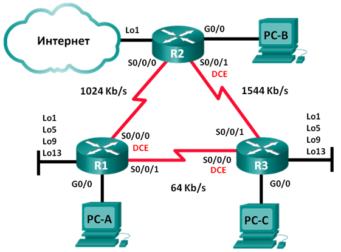

# Лабораторная работа. Настройка расширенных функций EIGRP для IPv4

## Топология

​                               

### Таблица адресации

| Устройство   | Интерфейс     | IP-адрес        | Маска подсети    | Шлюз по умолчанию |
| ------------ | ------------- | --------------- | ---------------- | ----------------- |
| R1           | G0/0          | 192.168.1.1     | 255.255.255.0    | —                 |
| S0/0/0 (DCE) | 192.168.12.1  | 255.255.255.252 | —                |                   |
| S0/0/1       | 192.168.13.1  | 255.255.255.252 | —                |                   |
| Lo1          | 192.168.11.1  | 255.255.255.252 | Н/Д (недоступно) |                   |
| Lo5          | 192.168.11.5  | 255.255.255.252 | —                |                   |
| Lo9          | 192.168.11.9  | 255.255.255.252 | —                |                   |
| Lo13         | 192.168.11.13 | 255.255.255.252 | —                |                   |
| R2           | G0/0          | 192.168.2.1     | 255.255.255.0    | —                 |
| S0/0/0       | 192.168.12.2  | 255.255.255.252 | —                |                   |
| S0/0/1 (DCE) | 192.168.23.1  | 255.255.255.252 | —                |                   |
| Lo1          | 192.168.22.1  | 255.255.255.252 | —                |                   |
| R3           | G0/0          | 192.168.3.1     | 255.255.255.0    | —                 |
| S0/0/0 (DCE) | 192.168.13.2  | 255.255.255.252 | —                |                   |
| S0/0/1       | 192.168.23.2  | 255.255.255.252 | —                |                   |
| Lo1          | 192.168.33.1  | 255.255.255.252 | Н/Д (недоступно) |                   |
| Lo5          | 192.168.33.5  | 255.255.255.252 | —                |                   |
| Lo9          | 192.168.33.9  | 255.255.255.252 | —                |                   |
| Lo13         | 192.168.33.13 | 255.255.255.252 | —                |                   |
| PC-A         | NIC           | 192.168.1.3     | 255.255.255.0    | 192.168.1.1       |
| PC-B         | NIC           | 192.168.2.3     | 255.255.255.0    | 192.168.2.1       |
| PC-C         | NIC           | 192.168.3.3     | 255.255.255.0    | 192.168.3.1       |

## Задачи

**Часть 1. Создание сети и настройка основных параметров устройства**

**Часть 2. Настройка EIGRP и проверка подключения**

**Часть 3. Настройка EIGRP для автоматического объединения**

**Часть 4. Настройка и распространение статического маршрута по умолчанию**

**Часть 5. Выполнение точной настройки EIGRP**

**·     Настройте параметры использования пропускной способности для EIGRP.**

**·     Настройте интервал отправки пакетов приветствия (hello) и таймер удержания для EIGRP**.


##  Создание сети и настройка основных параметров устройства


R1

```
Enable
configure terminal
hostname R1

interface serial 0/0
ip address 192.168.12.1 255.255.255.252
no shutdown
interface serial 1/0
ip address 192.168.13.1 255.255.255.252
no shutdown
interface gi2/0
ip address 192.168.1.1 255.255.255.0
no shutdown

line console 0
exec-timeout 0 0
exit
no ip domain-lookup
enable secret class
line vty 0 15
logging synchronous
password cisco
login
exit

do copy run start
[Enter]
```

R2

```
Enable
configure terminal
hostname R2

interface serial 0/0
ip address 192.168.12.2 255.255.255.252
no shutdown
interface serial 1/0
ip address 192.168.23.1 255.255.255.252
no shutdown
interface gi2/0
ip address 192.168.2.1 255.255.255.0
no shutdown

line console 0
exec-timeout 0 0
exit
no ip domain-lookup
enable secret class
line vty 0 15
logging synchronous
password cisco
login
exit

do copy run start
[Enter]
```

R3

```
Enable
configure terminal
hostname R3

interface serial 0/0
ip address 192.168.13.2 255.255.255.252
no shutdown
interface serial 1/0
ip address 192.168.23.2 255.255.255.252
no shutdown
interface gi2/0
ip address 192.168.3.1 255.255.255.0
no shutdown

line console 0
exec-timeout 0 0
exit
no ip domain-lookup
enable secret class
line vty 0 15
logging synchronous
password cisco
login
exit

do copy run start
[Enter]
```


## Настройка EIGRP и проверка подключения


На маршрутизаторе R1 настройте маршрутизацию EIGRP с номером автономной системы (AS) 1 для всех сетей с прямым подключением. Запишите использованные команды в поле ниже.

```
router eigrp 1
network 192.168.12.1 0.0.0.3
network 192.168.13.1 0.0.0.3
network 192.168.1.1 0.0.0.255
```

b.  Для интерфейса локальной сети маршрутизатора R1 отключите передачу пакетов приветствия (hello) EIGRP. Ниже напишите команду, которую вы использовали.

```
passive-interface gigabitEthernet 2/0
```

c.   На маршрутизаторе R1 настройте пропускную способность для интерфейса S0/0/0 равной 1024 Кбит/с, а для интерфейса S0/0/1 равной 64 Кбит/с. Запишите использованные команды в поле ниже. **Примечание**. Команда **bandwidth** влияет только на вычисление показателя EIGRP, а не на фактическую пропускную способность последовательного канала связи.

R1

```
interface serial 0/0 
bandwidth 1024
interface serial 1/0
bandwidth 64
```

d.  На маршрутизаторе R2 настройте маршрутизацию EIGRP с идентификатором AS 1 для всех сетей, отключите передачу пакетов приветствия (hello) EIGRP для интерфейса локальной сети и задайте пропускную способность для интерфейса S0/0/0 равной 1024 Кбит/с.

R2

```
router eigrp 1
network 192.168.2.1 0.0.0.255
network 192.168.12.2 0.0.0.3
network 192.168.23.1 0.0.0.3
passive-interface gigabitEthernet 2/0
interface serial 0/0
bandwidth 1024
```

e.   На маршрутизаторе R3 настройте маршрутизацию EIGRP с идентификатором AS 1 для всех сетей, отключите передачу пакетов приветствия (hello) EIGRP для интерфейса локальной сети и задайте пропускную способность для интерфейса S0/0/0 равной 64 Кбит/с.

```
router eigrp 1
network 192.168.3.1 0.0.0.255
network 192.168.13.2 0.0.0.3
network 192.168.23.2 0.0.0.3
passive-interface gigabitEthernet 2/0
interface serial 0/0
bandwidth 64
```

### Проверьте связь

С ПК А

```
C:\>ping 192.168.3.3

Pinging 192.168.3.3 with 32 bytes of data:

Reply from 192.168.3.3: bytes=32 time=2ms TTL=125
Reply from 192.168.3.3: bytes=32 time=2ms TTL=125
Reply from 192.168.3.3: bytes=32 time=2ms TTL=125
Reply from 192.168.3.3: bytes=32 time=2ms TTL=125

Ping statistics for 192.168.3.3:
    Packets: Sent = 4, Received = 4, Lost = 0 (0% loss),
Approximate round trip times in milli-seconds:
    Minimum = 2ms, Maximum = 2ms, Average = 2ms
```


## Настройка EIGRP для автоматического объединения


### Настройте EIGRP для автоматического объединения.

Введите команду **show ip protocols** на R1. Как по умолчанию настроено автоматическое объединение в EIGRP?

```
R1#show ip protocols 

Routing Protocol is "eigrp  1 " 
  Outgoing update filter list for all interfaces is not set 
  Incoming update filter list for all interfaces is not set 
  Default networks flagged in outgoing updates  
  Default networks accepted from incoming updates 
  EIGRP metric weight K1=1, K2=0, K3=1, K4=0, K5=0
  EIGRP maximum hopcount 100
  EIGRP maximum metric variance 1
Redistributing: eigrp 1
  Automatic network summarization is in effect  
  Automatic address summarization: 
    192.168.12.0/24 for GigabitEthernet2/0, Serial1/0
      Summarizing with metric 3011840
    192.168.13.0/24 for GigabitEthernet2/0, Serial0/0
      Summarizing with metric 40512000
  Maximum path: 4
  Routing for Networks:  
     192.168.12.0/30
     192.168.13.0/30
     192.168.1.0
  Passive Interface(s): 
    GigabitEthernet2/0
  Routing Information Sources:  
    Gateway         Distance      Last Update 
    192.168.12.2    90            4397620    
    192.168.13.2    90            5983078    
  Distance: internal 90 external 170
```

автоматическое объединение в EIGRP **включено**

### Настройте loopback-адреса на R1.

```
interface loopback1
ip address 192.168.11.1 255.255.255.252
interface loopback 5
ip address 192.168.11.5 255.255.255.252
interface loopback 9
ip address 192.168.11.9 252.255.255.252
interface loopback 13
ip address 192.168.11.13 255.255.255.252
```

### Добавьте соответствующие инструкции network для процесса EIGRP на маршрутизаторе R1. Запишите использованные команды в поле ниже.

```
router eigrp 1
network 192.168.11.1 0.0.0.3
network 192.168.11.5 0.0.0.3
network 192.168.11.9 0.0.0.3
network 192.168.11.13 0.0.0.3
```

### На маршрутизаторе R2 выполните команду **show ip route eigrp**. Как сети loopback представлены в результатах этой команды?

```
R2(config-if)#do sh ip route eigrp
D    192.168.1.0/24 [90/3014400] via 192.168.12.1, 00:39:04, Serial0/0
D    192.168.3.0/24 [90/2172416] via 192.168.23.2, 00:12:37, Serial1/0
D    192.168.11.0/24 [90/3139840] via 192.168.12.1, 00:00:12, Serial0/0
     192.168.12.0/24 is variably subnetted, 2 subnets, 2 masks
D       192.168.12.0/24 is a summary, 00:39:05, Null0
D    192.168.13.0/24 [90/41024000] via 192.168.12.1, 00:14:19, Serial0/0
                     [90/41024000] via 192.168.23.2, 00:12:37, Serial1/0
     192.168.23.0/24 is variably subnetted, 2 subnets, 2 masks
D       192.168.23.0/24 is a summary, 00:12:40, Null0
```

Сработала автосуммаризация сетей на 192.168.11.0/24

### На маршрутизаторе R1 выполните команду no **auto-summary** в рамках процесса EIGRP.

*`Так как автосуммаризация включена по умолчанию, то предположу, что тут была опечатка`* 

```
R1(config-router)#no auto-summary 
R1(config-router)#
%DUAL-5-NBRCHANGE: IP-EIGRP 1: Neighbor 192.168.12.2 (Serial0/0) resync: summary configured
%DUAL-5-NBRCHANGE: IP-EIGRP 1: Neighbor 192.168.13.2 (Serial1/0) resync: summary configured

```

Как изменилась таблица маршрутизации на R2 ?

```
R2(config)#do show ip route eigrp
D    192.168.1.0/24 [90/3014400] via 192.168.12.1, 00:00:29, Serial0/0
D    192.168.3.0/24 [90/2172416] via 192.168.23.2, 00:38:45, Serial1/0
     192.168.11.0/30 is subnetted, 3 subnets
D       192.168.11.0 [90/3139840] via 192.168.12.1, 00:00:29, Serial0/0
D       192.168.11.4 [90/3139840] via 192.168.12.1, 00:00:29, Serial0/0
D       192.168.11.12 [90/3139840] via 192.168.12.1, 00:00:29, Serial0/0
     192.168.12.0/24 is variably subnetted, 2 subnets, 2 masks
D       192.168.12.0/24 is a summary, 01:05:13, Null0
     192.168.13.0/24 is variably subnetted, 2 subnets, 2 masks
D       192.168.13.0/24 [90/41024000] via 192.168.23.2, 00:38:45, Serial1/0
D       192.168.13.0/30 [90/41024000] via 192.168.12.1, 00:00:29, Serial0/0
     192.168.23.0/24 is variably subnetted, 2 subnets, 2 masks
D       192.168.23.0/24 is a summary, 00:38:48, Null0
```

Повторите подшаги б–д, добавив интерфейсы обратной петли, сети процесса EIGRP и автоматическое объединение на маршрутизаторе R3.

```
interface loopback 1
ip address 192.168.33.1 255.255.255.252
interface loopback 5 
ip address 192.168.33.5 255.255.255.252
interface loopback 9
ip address 192.168.33.9 255.255.255.252
interface loopback 13
ip address 192.168.33.13 255.255.255.252

router eigrp 1
network 192.168.33.1 0.0.0.3
network 192.168.33.5 0.0.0.3
network 192.168.33.9 0.0.0.3
network 192.168.33.13 0.0.0.3
```


## Настройка и распространение статического маршрута по умолчанию


В части 4 вам необходимо настроить статический маршрут по умолчанию на R2 и распространить его на все остальные маршрутизаторы.

a.   Настройте loopback-адрес на R2.

```
interface loopback1
ip address 192.168.22.1 255.255.255.252
```

b.  Настройте статический маршрут по умолчанию с выходным интерфейсом Lo1.

```
R2(config)# ip route 0.0.0.0 0.0.0.0 Lo1
```

c.   Выполните команду **redistribute static** в рамках процесса EIGRP, чтобы распространить статический маршрут по умолчанию на другие участвующие маршрутизаторы.

```
R2(config)# router eigrp 1
R2(config-router)# redistribute static
```

d.  Используйте команду **show ip protocols** на маршрутизаторе R2, чтобы проверить, распространился ли этот статический маршрут.

```
R2#show ip protocols

Routing Protocol is "eigrp  1 " 
  Outgoing update filter list for all interfaces is not set 
  Incoming update filter list for all interfaces is not set 
  Default networks flagged in outgoing updates  
  Default networks accepted from incoming updates 
  EIGRP metric weight K1=1, K2=0, K3=1, K4=0, K5=0
  EIGRP maximum hopcount 100
  EIGRP maximum metric variance 1
Redistributing: eigrp 1, static 
  Automatic network summarization is in effect  
  Automatic address summarization: 
    192.168.12.0/24 for GigabitEthernet2/0, Serial1/0
      Summarizing with metric 3011840
    192.168.23.0/24 for GigabitEthernet2/0, Serial0/0
      Summarizing with metric 2169856
  Maximum path: 4
  Routing for Networks:  
     192.168.2.0
     192.168.12.0/30
     192.168.23.0/30
  Passive Interface(s): 
    GigabitEthernet2/0
  Routing Information Sources:  
    Gateway         Distance      Last Update 
    192.168.23.2    90            6062021    
    192.168.12.1    90            7418275    
  Distance: internal 90 external 170
```

a.   На маршрутизаторе R1 выполните команду **show ip route eigrp| include 0.0.0.0**, чтобы просмотреть инструкции, относящиеся к маршруту по умолчанию. Как статический маршрут по умолчанию представлен в результатах этой команды? Укажите административную дистанцию (AD) распространяемого маршрута.

```
R1(config-router)#do show ip route eigrp| include 0.0.0.0
show ip route eigrp| include 0.0.0.0
                     ^
% Invalid input detected at '^' marker.
```

Команда не работает   в  Packet Tracer , но без *include 0.0.0.0* все работает.

```
R1(config-router)#do show ip route eigrp
D    192.168.2.0/24 [90/3014400] via 192.168.12.2, 00:18:18, Serial0/0
D    192.168.3.0/24 [90/3526400] via 192.168.12.2, 00:13:13, Serial0/0
     192.168.12.0/24 is variably subnetted, 2 subnets, 2 masks
D       192.168.12.0/24 [90/41536000] via 192.168.13.2, 00:13:13, Serial1/0
     192.168.23.0/24 is variably subnetted, 2 subnets, 2 masks
D       192.168.23.0/24 [90/3523840] via 192.168.12.2, 00:18:18, Serial0/0
D       192.168.23.0/30 [90/41024000] via 192.168.13.2, 00:13:13, Serial1/0
     192.168.33.0/30 is subnetted, 4 subnets
D       192.168.33.0 [90/3651840] via 192.168.12.2, 00:10:48, Serial0/0
D       192.168.33.4 [90/3651840] via 192.168.12.2, 00:10:48, Serial0/0
D       192.168.33.8 [90/3651840] via 192.168.12.2, 00:10:48, Serial0/0
D       192.168.33.12 [90/3651840] via 192.168.12.2, 00:10:47, Serial0/0
D*EX 0.0.0.0/0 [170/4291840] via 192.168.12.2, 00:02:08, Serial0/0
```

Указан как EIGRP полученный извне , а административная дистанция (AD) распространяемого маршрута равна 170.

##  Подгонка EIGRP

###   Настройте параметры использования пропускной способности для EIGRP.

 Настройте последовательный канал между маршрутизаторами R1 и R2, чтобы разрешить трафику EIGRP использовать только 75 % пропускной способности канала.

```
R1(config)# interface s0/0
R1(config-if)# ip bandwidth-percent eigrp 1 75

R2(config)# interface s0/0
R2(config-if)# ip bandwidth-percent eigrp 1 75
```

В Packet Tracer опять же , не реализована эта команда 

```
R1(config-router)#interface s0/0
R1(config-if)#ip bandwidth-percent eigrp 1 75
                 ^
% Invalid input detected at '^' marker.
	
R1(config-if)#ip ba?
% Unrecognized command
```

 Настройте последовательный канал между маршрутизаторами R1 и R3, чтобы разрешить трафику EIGRP использовать только 40 % пропускной способности канала.

Невозможно выполнить по той же причине

### Настройте интервал отправки пакетов приветствия (hello) и таймер удержания для EIGRP.

На маршрутизаторе R2 используйте команду **show ip eigrp interfaces detail** для просмотра интервала приветствия и таймера задержки для EIGRP.

R2# **show ipeigrp interfaces detail**

```
EIGRP-IPv4 Interfaces for AS(1)
Xmit Queue   PeerQ        Mean   Pacing Time   Multicast    Pending
Interface              Peers  Un/Reliable  Un/Reliable  SRTT   Un/Reliable   Flow Timer   Routes
Se0/0/0                  1        0/0       0/0           1       0/15          50           0
Hello-interval is 5, Hold-time is 15
  Split-horizon is enabled
  Next xmit serial <none>
  Packetized sent/expedited: 29/1
  Hello's sent/expedited: 390/2
  Un/reliable mcasts: 0/0  Un/reliable ucasts: 35/39
Mcast exceptions: 0  CR packets: 0  ACKs suppressed: 0
  Retransmissions sent: 0  Out-of-sequence rcvd: 0
  Topology-ids on interface - 0
  Interface BW percentage is 75
  Authentication mode is not set
Se0/0/1                  1        0/0       0/0           1       0/16          50           0
Hello-interval is 5, Hold-time is 15
  Split-horizon is enabled
  Next xmit serial <none>
  Packetized sent/expedited: 34/5
  Hello's sent/expedited: 382/2
  Un/reliable mcasts: 0/0  Un/reliable ucasts: 31/42
Mcast exceptions: 0  CR packets: 0  ACKs suppressed: 2
  Retransmissions sent: 0  Out-of-sequence rcvd: 0
  Topology-ids on interface - 0
  Authentication mode is not set

```

К сожалению эта команда тоже не реализована в PacketTracer .  Но **без detail** показывает .

```
R2#show ip eigrp interfaces 
IP-EIGRP interfaces for process 1

                        Xmit Queue   Mean   Pacing Time   Multicast    Pending
Interface        Peers  Un/Reliable  SRTT   Un/Reliable   Flow Timer   Routes
Se0/0              1        0/0      1236       0/10           0           0
Se1/0              1        0/0      1236       0/10           0           0
```

Укажите значение таймера приветствия по умолчанию.
Укажите значение таймера удержания по умолчанию.

 Не имею возможности ответить на данные вопросы

 Для интерфейсов S0/0 и S1/0 маршрутизатора R1 настройте интервал приветствия равным 60 секунд, а таймер удержания равным 180 секунд, именно в этом порядке.

```
R1(config)# interface s0/0
R1(config-if)# ip hello-interval eigrp 1 60
R1(config-if)# ip hold-time eigrp 1 180
R1(config)# interface s1/0
R1(config-if)# ip hello-interval eigrp 1 60
R1(config-if)# ip hold-time eigrp 1 180
```

c.   Для последовательных интерфейсах маршрутизаторов R2 и R3 настройте интервал приветствия равным 60 секунд, а таймер удержания равным 180 секунд.

**Повторить не удалось ,по причине того,что в PT не реализовано изменение hold-time интервала...**

```
R1(config-if)#interface serial 0/0
R1(config-if)#ip ?
  access-group        Specify access control for packets
  address             Set the IP address of an interface
  authentication      authentication subcommands
  flow                NetFlow Related commands
  hello-interval      Configures IP-EIGRP hello interval
  helper-address      Specify a destination address for UDP broadcasts
  inspect             Apply inspect name
  ips                 Create IPS rule
  mtu                 Set IP Maximum Transmission Unit
  nat                 NAT interface commands
  ospf                OSPF interface commands
  split-horizon       Perform split horizon
  summary-address     Perform address summarization
  virtual-reassembly  Virtual Reassembly
```


## Вопросы для повторения

1. В чем заключаются преимущества объединения маршрутов?

Уменьшение таблицы маршрутизации. (best practics говорит, что нужно отключать его)

2. Почему при настройке таймеров EIGRP необходимо настраивать значение времени удержания равным или больше интервала приветствия?

Роутеры не подружатся .  Хелло интервалы проверяют, жив ли роутер . А после истечения времени удержания , то роутер будет считать его нерабочим.