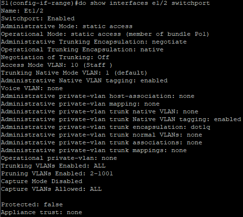

## Лабораторная работа. Настройка EtherChannel

### Топология

### Таблица адресации

| Устройство | Интерфейс | IP-адрес      | Маска подсети |
| ---------- | --------- | ------------- | ------------- |
| S1         | VLAN 99   | 192.168.99.11 | 255.255.255.0 |
| S2         | VLAN 99   | 192.168.99.12 | 255.255.255.0 |
| S3         | VLAN 99   | 192.168.99.13 | 255.255.255.0 |
| PC-A       | NIC       | 192.168.10.1  | 255.255.255.0 |
| PC-B       | NIC       | 192.168.10.2  | 255.255.255.0 |
| PC-C       | NIC       | 192.168.10.3  | 255.255.255.0 |

### Цели

##### Часть 1. Настройка базовых параметров коммутатора

##### Часть 2. Настройка PAgP

##### Часть 3. Настройка LACP

### Настройка базовых параметров коммутатора

Создание сети из примера лабораторной работы , а также настройка базовых параметров на коммутаторах: Имя хоста, создание inter vlan 99 , назначение ip-address ,отключение поиск DNS, шифрование незашифрованных паролей, Создание баннерного сообщения дня MOTD, назначение пароля class на привилегированный режим , пароль на VTY ,  настроим предотвращение прерывание команд , сохранение конфигурации.

**S1:**
enable 
conf t 
hos S1 
int vla 99 
S1: ip addr 192.168.99.11 255.255.255.0 
S2: ip addr 192.168.99.12 255.255.255.0  
S3: ip addr 192.168.99.13 255.255.255.0  
no shut 
exit 
no ip domain-loo 
service password-encryption 
Banner motd "This is a secure system. Authorized Access Only!" 
enable secret class 
line vty 0 4 
logging synchronous 
password cisco 
login 
exit 

Конечно на других устройствах будет другой номер имени Устройства и IP-адрес.
Далее отключение портов на коммутаторах:

int ran e0/1-3 
shut 
int ran e1/0-3 
shut 

 создание VLAN 99 , 10 именем **Management** и **Staff** соответственно

vlan 99 
name Management 
vlan 10 
name Staff 

Присвоим на портах коммутатора в сторону ПК режим доступа: 

int e0/0 
sw m ac 
sw ac v 10 

Сохраним конфигурацию:

do copy run start 
[Enter] 

Пропишем на ПК

**A:** 
ip 192.168.10.1/24 
save 
**B:** 
ip 192.168.10.2/24 
save 
**C:** 
ip 192.168.10.3/24 
save 

На всех остальных коммутаторах в сети конфигурация повторяется,поэтому не стал дублировать текст для каждого устройства.

### Настройка протокола PAgP

Настроим для S1 и S3 PAgP :

S1(config): 
int ran e1/2-3 
channel-group 1 mode desirable 
no shut 

S3(config): 

int ran e1/2-3 
channel-group 1 mode auto 
no shut 

**do show run interface e1/2**

**S1# show interfaces e1/2 switchport**

S3# **show etherchannel summary**

