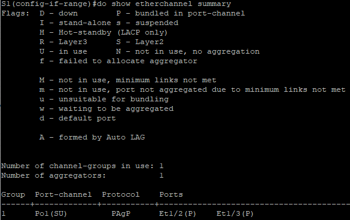

## Лабораторная работа. Настройка EtherChannel

### Топология


### Таблица адресации

| Устройство | Интерфейс | IP-адрес      | Маска подсети |
| ---------- | --------- | ------------- | ------------- |
| S1         | VLAN 99   | 192.168.99.11 | 255.255.255.0 |
| S2         | VLAN 99   | 192.168.99.12 | 255.255.255.0 |
| S3         | VLAN 99   | 192.168.99.13 | 255.255.255.0 |
| PC-A       | NIC       | 192.168.10.1  | 255.255.255.0 |
| PC-B       | NIC       | 192.168.10.2  | 255.255.255.0 |
| PC-C       | NIC       | 192.168.10.3  | 255.255.255.0 |

### Цели

##### Часть 1. Настройка базовых параметров коммутатора

##### Часть 2. Настройка PAgP

##### Часть 3. Настройка LACP


### Настройка базовых параметров коммутатора

Для начало настроим имя устройства:

**S1:**
enable <br/>
conf t <br/>
hos S1 ( S2, S3 соответственно на других устройствах ) 

Зададим IP  адресацию для устройств согласно условию:

int vla 99 <br/>
S1: ip addr 192.168.99.11 255.255.255.0 <br/>
S2: ip addr 192.168.99.12 255.255.255.0  <br/>S3: ip addr 192.168.99.13 255.255.255.0  <br/>no shut <br/>
exit <br/>

Отключим поиск DNS , зашифруем пароли ,а также назначим баннерное сообщение:

no ip domain-loo<br/>
service password-encryption<br/>
Banner motd "This is a secure system. Authorized Access Only!" <br/>

Зададим пароль на привилегированный режим , консольный режим и на VTY ,а также сервис по синхронной регистрации.

enable secret class <br/>
line vty 0 4 <br/>
logging synchronous<br/>
password cisco <br/>
login <br/>
exit <br/>
line con 0<br/>
logging synchronous<br/>
password cisco <br/>
login <br/>
exit <br/>

Отключим все порты на устройстве, кроме тех,что смотрят в сторону ПК

int ran e0/1-3<br/>
shut <br/>
int ran e1/0-3<br/>
shut <br/>

создадим VLAN 99 , 10 именем **Management** и **Staff** соответственно

vlan 99 <br/>
name Management <br/>
vlan 10 <br/>name Staff <br/>

Настроим порты коммутатора с присоединёнными узлами в качестве портов доступа в сети VLAN 10: 

int ran e0/1-3<br/>
sw m ac<br/>
int ran e1/0-3<br/>
sw m ac<br/>
int e0/0<br/>
sw m ac<br/>
sw ac vl 10<br/>

Сохраним конфигурацию:

do copy run start<br/>
[Enter] <br/>

Пропишем на ПК

**A:** 
ip 192.168.10.1/24 <br/>
save <br/>
**B:** 
ip 192.168.10.2/24 <br/>
save <br/>
**C:** 
ip 192.168.10.3/24 <br/>
save <br/>

### Настройка протокола PAgP

Настроим для S1 и S3 PAgP :

S1(config): 
int ran e1/2-3 <br/>
channel-group 1 mode desirable <br/>
no shut <br/>

S3(config): 

int ran e1/2-3 <br/>
channel-group 1 mode auto <br/>
no shut <br/>

do show run interface e1/2<br/>


**S1# show interfaces e1/2 switchport**<br/>


S3# **show etherchannel summary<br/>**



Как видим ,порты у нас в режиме доступа, надо это будет подправить. Так как эти порты находятся в группе, конфигурация этих портов упрощается :


S1(config)# 
interface port-channel 1<br/>
switchport trunk encapsulation dot1q<br/>
switchport mode trunk<br/>
switchport trunk native vlan 99<br/>
no shut<br/>

S3(config-if)# 
interface port-channel 1<br/>
switchport trunk encapsulation dot1q<br/>
switchport mode trunk<br/>
switchport trunk native vlan 99<br/>
no shut<br/>

Выполните команды **show run interface** *идентификатор-интерфейса* на S1 и S3. Какие команды включены в список для интерфейсов F0/3 и F0/4 на обоих коммутаторах? Сравните результаты с текущей конфигурацией для интерфейса Po1. Запишите наблюдения.

interface Ethernet1/2<br/>
 switchport access vlan 10<br/>
 switchport trunk encapsulation dot1q<br/>
 switchport trunk native vlan 99<br/>
 switchport mode trunk<br/>
 channel-group 1 mode desirable<br/>
end<br/>

Команды одинаковы с одной и другой стороны

Выполните команды **show interfaces trunk** и **show spanning-tree** на S1и S3. Какой транковый порт включен в список? Какая используется сеть native VLAN? Какой вывод можно сделать на основе выходных данных?

Порт Po1 с Native VLAN 99 , мы используем PAgP

Какие значения стоимости и приоритета порта для агрегированного канала отображены в выходных данных команды **show spanning-tree**?

Уменьшилось со 100 до 56 (проверил на обоих коммутаторах)


###   **Настройка протокола LACP**

Перейдем к настройке портов S1 - S2

S1(config)# 
interface range e0/1-2<br/>
switchport trunk encapsulation dot1q<br/>
switchport mode trunk<br/>
switchport trunk native vlan 99<br/>
channel-group 2 mode active<br/>
no shutdown<br/>
exit<br/>

S2(config)# 
interface range e0/1-2<br/>
switchport trunk encapsulation dot1q<br/>
switchport mode trunk<br/>
switchport trunk native vlan 99<br/>
channel-group 2 mode active<br/>
no shutdown<br/>
exit<br/>

Проверим за какой группой какой протокол стоит:

S1(config)#do show etherchannel summary<br/>


Перейдем к настройке портов S2 - S3

S2(config)# 
interface range e1/0-1<br/>
switchport trunk encapsulation dot1q<br/>
switchport mode trunk<br/>
switchport trunk native vlan 99<br/>
channel-group 2 mode active<br/>
no shutdown<br/>
exit<br/>

S3(config)# 
interface range  e1/0-1<br/>
switchport trunk encapsulation dot1q<br/>
switchport mode trunk<br/>
switchport trunk native vlan 99<br/>
channel-group 2 mode active<br/>
no shutdown<br/>
exit<br/>

Что может препятствовать образованию каналов EtherChannel?

разный режим работы порта (Дуплекс,полудуплекс) , разная скорость порта , неодинаковые VLAN и Native VLAN , одинаковый режим интерфейса ( access/ trunk )  


И наконец полезные команды укажу:

```
show etherchannel summary
show etherchannel 1 port-channel
show interfaces etherchannel
```