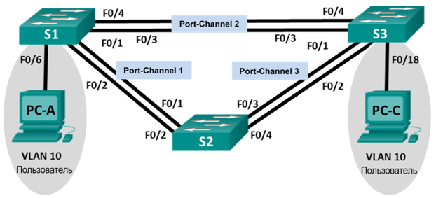
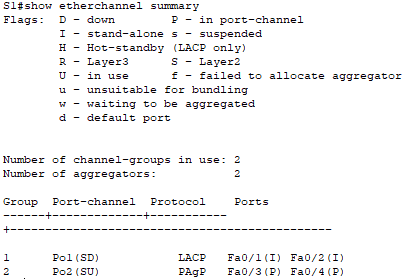
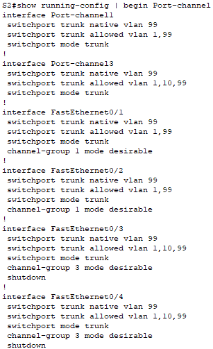
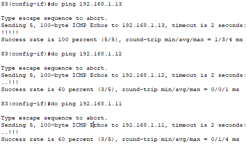
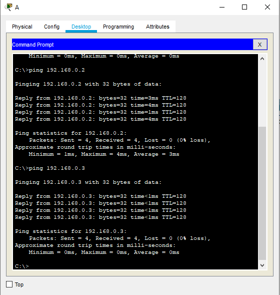

## Лабораторная работа. Поиск и устранение неполадок в работе EtherChannel

### Топология

### Таблица адресации

| **Устройство** | **Интерфейс** | **IP-адрес** | **Маска подсети** |
| -------------- | ------------- | ------------ | ----------------- |
| S1             | VLAN 99       | 192.168.1.11 | 255.255.255.0     |
| S2             | VLAN 99       | 192.168.1.12 | 255.255.255.0     |
| S3             | VLAN 99       | 192.168.1.13 | 255.255.255.0     |
| PC-A           | NIC           | 192.168.0.2  | 255.255.255.0     |
| PC-C           | NIC           | 192.168.0.3  | 255.255.255.0     |

### Назначения сети VLAN

| VLAN | Имя        |
| ---- | ---------- |
| 10   | User       |
| 99   | Управление |

### Задачи

Часть 1. Построение сети и загрузка настроек устройств

Часть 2. Отладка EtherChannel

###  Построение сети и загрузка настроек устройств

**Конфигурация коммутатора S1:**

hostname S1 
interface range f0/1-24, g0/1-2 
shutdown 
exit 
enable secret class 
no ip domain lookup 
line vty 0 15 
password cisco 
login 
line con 0 
password cisco 
logging synchronous 
login 
exit 
vlan 10 
name User 
vlan 99 
Name Management 
interface range f0/1-2 
switchport mode trunk 
channel-group 1 mode active 
switchport trunk native vlan 99 
no shutdown 
interface range f0/3-4 
channel-group 2 mode desirable 
switchport trunk native vlan 99 
no shutdown 
interface f0/6 
switchport mode access 
switchport access vlan 10 
no shutdown 
interface vlan 99 
ip address 192.168.1.11 255.255.255.0 
interface port-channel 1 
switchport trunk native vlan 99 
switchport mode trunk 
interface port-channel 2 
switchport trunk native vlan 99 
switchport mode access 

**Конфигурация коммутатора S2:**

hostname S2 
interface range f0/1-24, g0/1-2 
shutdown 
exit 
enable secret class 
no ip domain lookup 
line vty 0 15 
password cisco 
login 
line con 0 
password cisco 
logging synchronous 
login 
exit 
vlan 10 
name User 
vlan 99 
name Management 
spanning-tree vlan 1,10,99 root primary 
interface range f0/1-2 
switchport mode trunk 
channel-group 1 mode desirable 
switchport trunk native vlan 99 
no shutdown 
interface range f0/3-4 
switchport mode trunk 
channel-group 3 mode desirable 
switchport trunk native vlan 99 
interface vlan 99 
ip address 192.168.1.12 255.255.255.0 
interface port-channel 1 
switchport trunk native vlan 99 
switchport trunk allowed vlan 1,99 
interface port-channel 3 
switchport trunk native vlan 99 
switchport trunk allowed vlan 1,10,99,99 
switchport mode trunk 

**Конфигурация коммутатора S3:**

hostname S3 
interface range f0/1-24, g0/1-2 
shutdown 
exit 
enable secret class 
no ip domain lookup 
line vty 0 15 
password cisco 
login 
line con 0 
password cisco 
logging synchronous 
login 
exit 
vlan 10 
name User 
vlan 99 
name Management 
interface range f0/1-2 
interface range f0/3-4 
switchport mode trunk 
channel-group 3 mode desirable 
switchport trunk native vlan 99 
no shutdown 
interface f0/18 
switchport mode access 
switchport access vlan 10 
no shutdown 
interface vlan 99 
ip address 192.168.1.13 255.255.255.0 
interface port-channel 3 
no switchport trunk native vlan 99 
no switchport mode trunk 

#### Шаг 1:   Выполните поиск и устранение неполадок в работе маршрутизатора S1.

**show interfaces trunk** - команда пустая ,а это значит не в одну сторону не настроены trunk порты

**show etherchannel summary** - указывает настроенный LACP, что противоречит условию

S1(config-if)# **do show run | begin interface Port-channel**  - на 2 группе каналов стоит режим доступа

Исправим это :

S1(config)# 
<<<<<<< HEAD

interface port-channel 2 
switchport mode trunk 
switchport trunk allowed vlan 1,10,99 

no interface port-channel 1 
interface port-channel 1 
switchport mode trunk 
switchport trunk native vlan 99 
switchport trunk allowed vlan 1,10,99 

interface range fastEthernet 0/1-2 
channel-group 1 mode auto  

#### Шаг 2:   Выполните поиск и устранение неполадок в работе маршрутизатора S2.

S2(config)#interface port-channel 1 
no switchport trunk allowed vlan 1,99 
switchport trunk allowed vlan 1,10,99 

interface range fastEthernet 0/3-4 
no shutdown  

#### Шаг 3:   Выполните поиск и устранение неполадок в работе маршрутизатора S3.

На 3 перепутаны процессы PAgP и отсутствуют настройки на interface range fastEthernet 0/1-2  
Так что переделаем все заново настройки .

interface range fastEthernet 0/3-4 
no channel-group 3 mode desirable 
no switchport trunk native vlan 99 
no switchport mode trunk 

interface range fastEthernet 0/1-2 
channel-group 3 mode auto  

interface port-channel 3 
switchport mode trunk 
switchport trunk native vlan 99 
switchport trunk allowed vlan 1,10,99 

interface range fastEthernet 0/3-4 
 channel-group 2 mode auto 

interface port-channel 2 
switchport mode trunk 
switchport trunk native vlan 99 
switchport trunk allowed vlan 1,10,99 

interface port-channel 2 
switchport mode trunk 

interface range f0/1-2 
no channel-group 1 mode active 

no interface port-channel 1 

int r f0/1-2 
channel-group 1 mode auto 

interface port-channel 1 
switchport mode trunk 
switchport trunk native vlan 99 
switchport trunk allowed vlan 1,10 

#### Шаг 4: Проверка связности коммутаторов S1, S2, S3 и  ПК А , ПК С.

При проверке ,оказалось, что ping не проходят , тогда я выключил  interface vlan 1 и поднял 99.
После проделанных манипуляций, всё заработало. Чтобы не городить огород из скриншотов ,покажу логи за S3.

s

Ping с ПК А на С тоже идут ,  а это значит, что с задачей справился.

