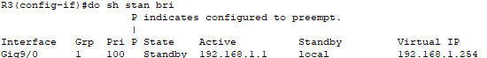
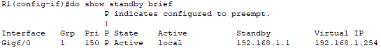

# Лабораторная работа. Настройка HSRP

## Топология

## Таблица адресации

| Устройство | Интерфейс     | IP-адрес        | Маска подсети   | Шлюз по умолчанию |
| ---------- | ------------- | --------------- | --------------- | ----------------- |
| R1         | G0/1          | 192.168.1.1     | 255.255.255.0   | —                 |
|            | S0/0/0  (DCE) | 10.1.1.1        | 255.255.255.252 | —                 |
| R2         | S0/0/0        | 10.1.1.2        | 255.255.255.252 | —                 |
|            | S0/0/1  (DCE) | 10.2.2.2        | 255.255.255.252 | —                 |
|            | Lo1           | 209.165.200.225 | 255.255.255.224 | —                 |
| R3         | G0/1          | 192.168.1.3     | 255.255.255.0   | —                 |
|            | S0/0/1        | 10.2.2.1        | 255.255.255.252 | —                 |
| S1         | VLAN 1        | 192.168.1.11    | 255.255.255.0   | 192.168.1.1       |
| S3         | VLAN 1        | 192.168.1.13    | 255.255.255.0   | 192.168.1.3       |
| PC-A       | NIC           | 192.168.1.31    | 255.255.255.0   | 192.168.1.1       |
| PC-C       | NIC           | 192.168.1.33    | 255.255.255.0   | 192.168.1.3       |

## Задачи

**Часть 1. Построение сети и проверка соединения**

**Часть 2. Настройка обеспечения избыточности на первом хопе с помощью HSRP** /

## Построение сети и проверка соединения

Мы уже соединили все узлы согласно нашей лабораторной работе , а теперь займемся настройкой Роутеров и Коммутаторов. Так как настройка устройств типична для каждого вида ,то распишу лишь настройку **R1** и **S1**.

**Router:**

Enable 
Configure terminal 

no ip domain-lookup  
hos R1 
interface Serial5/0 
ip address 10.1.1.1 255.255.255.252 
clock rate 128000 
interface GigabitEthernet6/0 
ip address 192.168.1.1 255.255.255.0 

enable secret class  
line vty 0 4  
logging synchronous  
password cisco  
login  
end 
copy running-config startup-config 
[Enter] 

**Switch:** 

Enable 
Configure terminal 

no ip domain-lookup  
hostname S1 
enable secret class  

interface Vlan1 
ip address 192.168.1.11 255.255.255.0 

ip default-gateway 192.168.1.1 

line vty 0 4  
logging synchronous  
password cisco  
login 
end 
copy running-config startup-config 
[Enter] 

Проверка подключения : 

1. ПК А и ПК С ping 192.168.1.33 

   Pinging 192.168.1.33 with 32 bytes of data: 

   Reply from 192.168.1.33: bytes=32 time=1ms TTL=128 
   Reply from 192.168.1.33: bytes=32 time=1ms TTL=128 
   Reply from 192.168.1.33: bytes=32 time<1ms TTL=128 
   Reply from 192.168.1.33: bytes=32 time<1ms TTL=128 

2. Запустите сеанс эхо-тестирования на PC-A и разорвите соединение между S1 и R1 

C: />ping 209.165.200.225 

Pinging 209.165.200.225 with 32 bytes of data: 

Request timed out. 
Request timed out. 
Request timed out. 
Request timed out. 

Ping statistics for 209.165.200.225: 

​    Packets: Sent = 4, Received = 0, Lost = 4 (100% loss) 

Эхо трафик перестал ходит по причине обрыва шлюза по умолчанию 192.168.1.1 ,  ранее пинги проходили .

С ПК-С проходят ping , так как доступен шлюз по умолчанию 

C: />ping 209.165.200.225 

Pinging 209.165.200.225 with 32 bytes of data: 

Reply from 209.165.200.225: bytes=32 time=2ms TTL=254 
Reply from 209.165.200.225: bytes=32 time=1ms TTL=254 
Reply from 209.165.200.225: bytes=32 time=1ms TTL=254 
Reply from 209.165.200.225: bytes=32 time=1ms TTL=254 

Ping statistics for 209.165.200.225: 
    Packets: Sent = 4, Received = 4, Lost = 0 (0% loss), 
Approximate round trip times in milli-seconds: 
    Minimum = 1ms, Maximum = 2ms, Average = 1ms 

### Настройте HSRP на R1 и R3.

В этом шаге вам предстоит настроить HSRP и изменить адрес шлюза по умолчанию на компьютерах PC-A, PC-C, S1 и коммутаторе S2 на виртуальный IP-адрес для HSRP. R1 назначается активным маршрутизатором с помощью команды приоритета HSRP.

 Настройте протокол HSRP на маршрутизаторе R1.

R1(config)# **interface g0/1** 
R1(config-if)# **standby version 2** 
R1(config-if)# **standby 1 ip 192.168.1.254** 
R1(config-if)# **standby 1 priority 150** 
R1(config-if)# **standby 1 preempt** 

Настройте протокол HSRP на маршрутизаторе R3.

R3(config)# **interface g0/1** 
R3(config-if)# **standby version 2** 
R3(config-if)# **standby 1 ip 192.168.1.254** 

Проверьте HSRP, выполнив команду **show standby** на R1 и R3.

Какой маршрутизатор является активным? 

R1 является активным роутером

Какой MAC-адрес используется для виртуального IP-адреса?

MAC-адрес **0000.0C9F.F001** используется для виртуального IP-адреса

Какой IP-адрес и приоритет используются для резервного маршрутизатора?

Приоритет 100

Используйте команду **show standby brief** на R1 и R3, чтобы просмотреть сводку состояния HSRP. 

 Измените адрес шлюза по умолчанию для PC-A, PC-C, S1 и S3. Какой адрес следует использовать?

192.168.1.254

Проверьте новые настройки. Отправьте эхо-запрос с PC-A и с PC-C на loopback-адрес маршрутизатора R2. Успешно ли выполнены эхо-запросы? 

###  Запустите сеанс эхо-тестирования на PC-A и разорвите соединение с коммутатором, подключенным к активному маршрутизатору HSRP (R1).

C: />ping -t 209.165.200.225

Pinging 209.165.200.225 with 32 bytes of data:

Reply from 209.165.200.225: bytes=32 time=8ms TTL=254 
Reply from 209.165.200.225: bytes=32 time=1ms TTL=254 
Reply from 209.165.200.225: bytes=32 time=8ms TTL=254 
Reply from 209.165.200.225: bytes=32 time=1ms TTL=254 
Request timed out. 
Request timed out. 
Reply from 209.165.200.225: bytes=32 time=8ms TTL=254 
Reply from 209.165.200.225: bytes=32 time=1ms TTL=254 
Reply from 209.165.200.225: bytes=32 time=8ms TTL=254 
Reply from 209.165.200.225: bytes=32 time=1ms TTL=254 

Ping statistics for 209.165.200.225: 
       Packets: Sent = 10, Received = 8, Lost = 2 (20% loss), 
Approximate round trip times in milli-seconds: 
      Minimum = 1ms, Maximum = 8ms, Average = 1ms 

Как видим, 2 потерянных эхо запроса ушло на восстановление 

### Проверьте настройки HSRP на маршрутизаторах R1 и R3.

a.   Выполните команду **show standby brief** на маршрутизаторах R1 и R3.

Какой маршрутизатор является активным?    R1 

Повторно подключите кабель, соединяющий коммутатор и маршрутизатор, или включите интерфейс F0/5. Какой маршрутизатор теперь является активным? Поясните ответ.   

R1  так как приоритет выше

###  Изменение приоритетов HSRP.

a.   Измените приоритет HSRP на 200 на маршрутизаторе R3. Какой маршрутизатор является активным?     **R1**

b.  Выполните команду, чтобы сделать активным маршрутизатор R3 без изменения приоритета. Какую команду вы использовали?

R3(config-if)#standby 1 preempt

c.   Используйте команду **show**, чтобы убедиться, что R3 является активным маршрутизатором.

Вопросы для повторения

Для чего в локальной сети может потребоваться избыточность?

Обеспечение безотказного доступа к ресурсам