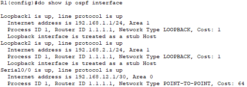

# Лабораторная работа. Настройка OSPFv2 для нескольких областей

## Топология

## Таблица адресации

| Устройство | Интерфейс    | IP-адрес        | Маска подсети   |
| ---------- | ------------ | --------------- | --------------- |
| R1         | Lo0          | 209.165.200.225 | 255.255.255.252 |
|            | Lo1          | 192.168.1.1     | 255.255.255.0   |
|            | Lo2          | 192.168.2.1     | 255.255.255.0   |
|            | S0/0/0 (DCE) | 192.168.12.1    | 255.255.255.252 |
| R2         | Lo6          | 192.168.6.1     | 255.255.255.0   |
|            | S0/0/0       | 192.168.12.2    | 255.255.255.252 |
|            | S0/0/1 (DCE) | 192.168.23.1    | 255.255.255.252 |
| R3         | Lo4          | 192.168.4.1     | 255.255.255.0   |
|            | Lo5          | 192.168.5.1     | 255.255.255.0   |
|            | S0/0/1       | 192.168.23.2    | 255.255.255.252 |

## Задачи

**Часть 1. Создание сети и настройка основных параметров устройства**

**Часть 2. Настройка сети OSPFv2 для нескольких областей**

**Часть 3. Настройка межобластных суммарных маршрутов**

## Создание сети и настройка основных параметров устройства

**R1**

Enable 
Configure terminal 
hostname R1 
Interface loopback 0 
ip address 209.165.200.225 255.255.255.252 
Interface loopback 1 
ip address 192.168.1.1 255.255.255.0 
Interface loopback 2 
ip address 192.168.2.1 255.255.255.0 
exit 
interface serial 0/0 
ip address 192.168.12.1 255.255.255.252 
clock rate 128000 
no shutdown 
exit 
no ip domain-lookup 
enable secret class 
line vty 0 15 
logging synchronous 
password cisco 
login 
exit 
line con 0 
logging synchronous 
password cisco 
login 
Banner motd "This is a secure system. Authorized Access Only!" 
do copy run start 
[Enter] 

**R2**

Enable 
Configure terminal 
hostname R2 
Interface loopback 6 
ip address 192.168.6.1 255.255.255.0 
exit 
interface serial 0/0 
ip address 192.168.12.2 255.255.255.252 
no shutdown 
exit 
interface serial 1/0 
ip address 192.168.23.1 255.255.255.252 
clock rate 128000 
no shutdown 
exit 
no ip domain-lookup 
enable secret class 
line vty 0 4 
logging synchronous 
password cisco 
login 
exit 
line con 0 
logging synchronous 
password cisco 
login 
exit 
Banner motd "This is a secure system. Authorized Access Only!" 
do copy run start 
[Enter] 

**R3**

enable 
configure terminal 
hostname R3 
interface serial 0/0 
ip address 192.168.23.2 255.255.255.252 
no shutdown 
exit 
interface loopback 4  
ip address 192.168.4.1 255.255.255.0 
exit 
interface loopback 5 
ip address 192.168.5.1 255.255.255.0 
exit 
no ip domain-lookup 
enable secret class 
line vty 0 4 
logging synchronous 
password cisco 
login 
exit 
line con 0 
logging synchronous 
password cisco 
login 
exit 
Banner motd "This is a secure system. Authorized Access Only!" 
do copy run start 
[Enter] 

**Проверьте наличие подключения на уровне 3.**

Выполните команду **show ip interface brief**, чтобы убедиться в правильности IP-адресации и активности интерфейсов. Убедитесь, что каждый маршрутизатор может успешно отправлять эхо-запросы соседним маршрутизаторам, подключенным с помощью последовательных интерфейсов.

## Настройка сети OSPFv2 для нескольких областей

В части 2 необходимо настроить сеть OSPFv2 для нескольких областей, используя идентификатор процесса 1. Все интерфейсы loopback локальной сети должны быть пассивными, а для всех последовательных интерфейсов должна быть настроена аутентификация MD5 с ключом **Cisco123**

###  Определите типы маршрутизаторов OSPF в топологии.

Определите магистральные маршрутизаторы:  R1, R2, R3

Определите граничные маршрутизаторы автономной системы (ASBR):  R1

Определите граничные маршрутизаторы области (ABR):  R1 , R2

Определите внутренние маршрутизаторы:  R3

### Настройте протокол OSPF на маршрутизаторе R1.

Настроим сети OSPF на R1 , укажем пассивные интерфейсы , а также будем рассказывать по OSPF о дефолтном маршруте выхода в интернет.

router ospf 1 
router-id 1.1.1.1 
network192.168.1.0 0.0.0.255 area 1 
network 192.168.2.0 0.0.0.255 area 1 
 network 192.168.12.0 0.0.0.3 area 0 
 passive-interface Loopback1 
 passive-interface Loopback2 
default-information originate 
exit  
ip route 0.0.0.0 0.0.0.0 loopback 0 
do clear ip ospf process 
[yes] 

### Настройте протокол OSPF на маршрутизаторе R2.

router ospf 1 
router-id 2.2.2.2 
network 192.168.6.0 0.0.0.255 area 3 
network 192.168.12.0 0.0.0.3 area 0 
network 192.168.23.0 0.0.0.3 area 3 
passive-interface Loopback6 
do clear ip ospf process 
[yes] 

### Настройте протокол OSPF на маршрутизаторе R3.

router ospf 1 
router-id 3.3.3.3 
network 192.168.23.0 0.0.0.3 area 3 
passive-interface Loopback4 
passive-interface Loopback5 
network 192.168.4.0 0.0.0.255 area 3 
network 192.168.5.0 0.0.0.255 area 3 
do clear ip ospf process 
[yes] 

###  Убедитесь в правильности настройки протокола OSPF и в установлении отношений смежности между маршрутизаторами.

Интересно ,то ,что настройку выполнил по схеме , а строки  `It is an area border router`не оказалось. Возможно глюк Packet Tracer.

К какому типу маршрутизаторов OSPF относится каждый маршрутизатор?

R1: ASBR , ABR, Backbone router

R2: ABR, Backbone router

R3: Internal router

Убедимся в установлении отношений смежности OSPF между маршрутизаторами.

Команда **show ip ospf interface brief** не реализована в Packet Tracer ,которая отображает   сводку стоимости маршрутов интерфейсов.
Зато show ip ospf interface реализован , с более подробной информацией 

На остальных роутерах аналогичная картина, Serial интерфейсы стоимостью 64 , Loopback стоимостью равны 1.

### Настройте аутентификацию MD5 для всех последовательных интерфейсов

**R1** 

interface Serial0/0 
ip ospf authentication message-digest 
ip ospf message-digest-key 1 md5 Cisco123 

**R2**

interface Serial0/0 
ip ospf authentication message-digest 
ip ospf message-digest-key 1 md5 Cisco123 

interface Serial1/0 
ip ospf authentication message-digest 
ip ospf message-digest-key 1 md5 Cisco123 

**R3**

interface Serial0/0 
 ip ospf authentication message-digest 
 ip ospf message-digest-key 1 md5 Cisco123 

Почему перед настройкой аутентификации OSPF полезно проверить правильность работы OSPF?

Очевидно же, чтобы проблем себе не прибавлять ,после того, как пропишем процесс OSPF на каждом роутере.

### Проверьте восстановление отношений смежности OSPF.

##  Настройка межобластных суммарных маршрутов

Все маршруты помеченные как (`O IA`) являются межобластным маршрутом.

### Просмотрите базы данных LSDB на всех маршрутизаторах

R1

R2

R3

### Настройте межобластные суммарные маршруты

Настроим суммарный маршрут для сетей в области 1 на R1.

R1(config)# **router ospf 1** 
R1(config-router)# **area 1 range 192.168.0.0 255.255.252.0** 

Настроим суммарный маршрут для сетей в области 3 на R2.

R2(config)# **router ospf 1** 
R2(config-router)#**area 3 range 192.168.4.0 255.255.254.0** 

На скриншотах выше показано использование команды и её результаты работы ,которые повлияли на таблицу маршрутизации. Таблица стала меньше ,более компактной.

### Повторно отобразите таблицы маршрутизации OSPF для всех маршрутизаторов.

Выполним команду **show ip route ospf** на каждом маршрутизаторе. Запишим результаты для суммарных и межобластных маршрутов.

### Просмотрите базы данных LSDB на всех маршрутизаторах.

R1

R2

R3

Пакет LSA какого типа передается в магистраль маршрутизатором ABR, когда включено объединение межобластных маршрутов?

Summary Net Link States , то есть LSA 3 типа

###  Проверьте наличие сквозного соединения.

Проверил  доступность каждой сети . Как и в начале , до каждой сети можно добраться с каждого роутера. Не вижу смысла выводить скриншоты.

Вопросы для повторения

Какие три преимущества при проектировании сети предоставляет OSPF для нескольких областей?

- **Снижение накладных расходов на обновление состояний каналов.**
- **Таблицы маршрутизации меньшего размера**. 
- **Снижение частоты расчётов кратчайшего пути SPF**.

