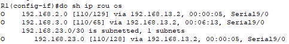

# Лабораторная работа. Настройка базового протокола OSPFv2 для одной области

## Топология

## Таблица адресации

| Устройство   | Интерфейс    | IP-адрес        | Маска подсети | Шлюз по умолчанию |
| ------------ | ------------ | --------------- | ------------- | ----------------- |
| R1           | G0/0         | 192.168.1.1     | 255.255.255.0 | —                 |
| S0/0/0 (DCE) | 192.168.12.1 | 255.255.255.252 | —             |                   |
| S0/0/1       | 192.168.13.1 | 255.255.255.252 | —             |                   |
| R2           | G0/0         | 192.168.2.1     | 255.255.255.0 | —                 |
| S0/0/0       | 192.168.12.2 | 255.255.255.252 | —             |                   |
| S0/0/1 (DCE) | 192.168.23.1 | 255.255.255.252 | —             |                   |
| R3           | G0/0         | 192.168.3.1     | 255.255.255.0 | —                 |
| S0/0/0 (DCE) | 192.168.13.2 | 255.255.255.252 | —             |                   |
| S0/0/1       | 192.168.23.2 | 255.255.255.252 | —             |                   |
| PC-A         | NIC          | 192.168.1.3     | 255.255.255.0 | 192.168.1.1       |
| PC-B         | NIC          | 192.168.2.3     | 255.255.255.0 | 192.168.2.1       |
| PC-C         | NIC          | 192.168.3.3     | 255.255.255.0 | 192.168.3.1       |

## Задачи

Часть 1. Создание сети и настройка основных параметров устройства

Часть 2. Настройка и проверка маршрутизации OSPF

Часть 3. Изменение назначений идентификаторов маршрутизаторов

Часть 4. Настройка пассивных интерфейсов OSPF

Часть 5. Изменение метрик OSPF

### Создание сети и настройка основных параметров устройства

**R1**

enable 
conf t 
hos R1 

no ip domain-lookup 
enable secret class  
line vty 0 4  
logging synchronous  
password cisco  
login  
exit  
line con 0  
logging synchronous  
password cisco  
login  
exit  
Banner motd "This is a secure system. Authorized Access Only!" 

int gi7/0 
ip addr 192.168.1.1 255.255.255.0 
no shut 
exit 
int se8/0 
 clock rate 128000  
ip addr 192.168.12.1 255.255.255.252 
no shut 
exit 
int se9/0 
ip addr 192.168.13.1 255.255.255.252 
no shut 
exit 
line con 0 
exec-t 0 0 
exit 
do copy run start 
[Enter] 

**R2**

en 
conf t 
hos R2 

no ip domain-lookup 
enable secret class  
line vty 0 4  
logging synchronous  
password cisco  
login  
exit  
line con 0  
logging synchronous  
password cisco  
login  
exit  
Banner motd "This is a secure system. Authorized Access Only!" 

no ip domain-lookup 
int se8/0 
ip addr 192.168.12.2 255.255.255.252 
no shut 
exit 
int se9/0 
 clock rate 128000  
ip addr 192.168.23.1 255.255.255.252 
no shut 
exit 
int gi 7/0 
ip addr 192.168.2.1 255.255.255.0 
no shut 
exit 
line con 0 
exec-t 0 0 
exit 
do copy run start 
[Enter] 

**R3**

ena 
conf t 
hos R3 

no ip domain-lookup 
enable secret class  
line vty 0 4  
logging synchronous  
password cisco  
login  
exit  
line con 0  
logging synchronous  
password cisco  
login  
exit  
Banner motd "This is a secure system. Authorized Access Only!" 

int se8/0 
 clock rate 128000  
ip addr 192.168.13.2 255.255.255.252 
no shut 
exit 
int se 9/0 
ip addr 192.168.23.2 255.255.255.252 
no shut 
exit 
int gi7/0 
ip addr 192.168.3.1 255.255.255.0 
no shut 
exit 
line con 0 
exec-t 0 0 
exit 
do copy run start 
[Enter] 

### Настройка и проверка маршрутизации OSPF

Настроим протокол OSPF на роутерах:

R1

router ospf 1 
network 192.168.1.0 0.0.0.255 area 0 
network 192.168.12.0 0.0.0.3 area 0 
network 192.168.13.0 0.0.0.3 area 0 

R2

router ospf 1 
network 192.168.2.0 0.0.0.255 area 0 
network 192.168.12.0 0.0.0.3 area 0 
network 192.168.23.0 0.0.0.3 area 0 

R3

router ospf 1 
network 192.168.3.0 0.0.0.255 area 0 
network 192.168.13.0 0.0.0.3 area 0 
network 192.168.23.0 0.0.0.3 area 0 

Проверим информацию о соседних устройствах и маршрутизации OSPF

**show ip ospf neighbor**

**show ip route**

**show ip protocols** 

**show ip ospf**

**show ip ospf interface brief**  - Не реализован в Packet Tracer 

**Show ip ospf interface**

Ping на все ПК

###   Изменение назначенных идентификаторов маршрутизаторов

R1(config)# **interface lo0** 
R1(config-if)# **ip address 1.1.1.1 255.255.255.255** 
R1(config-if)# **end** 

На R2 2.2.2.2  и  на  R3 3.3.3.3 , после перезагружаем маршрутизаторы командой **reload**

Поменяем идентификатор с помощью Router id теперь на:

R1 11.11.11.11 
R2 22.22.22.22 
R3 33.33.33.33 

R1(config)# **router ospf 1** 
R1(config-router)# **router-id 11.11.11.11** 
R1(config)# **end** 
R1# **clear ip ospf process**  

###   Настройка пассивных интерфейсов OSPF

Проверим интерфейс который идет в сторону ПК

R1(config)# **router ospf 1** 
R1(config-router)# **passive-interface g7/0** 

Повторно выполните команду **show ip ospf interface g7/0**, чтобы убедиться, что интерфейс G0/0 стал пассивным.

   

Введите команду **show ip route** на маршрутизаторах R2 и R3, чтобы убедиться, что маршрут к сети 192.168.1.0/24 остается доступным.

команду **show ip ospf neighbor** на маршрутизаторе R1, чтобы убедиться, что R2 указан в качестве соседнего устройства OSPF

###  Настройте на маршрутизаторе пассивный интерфейс в качестве интерфейса по умолчанию.

R2(config)# **router ospf 1** 
R2(config-router)# **passive-interface default** 

R1(config-router)#**do  show ip ospf neighbor**  

Neighbor ID     Pri   State           Dead Time   Address         Interface

33.33.33.33       0   FULL/  -        00:00:35    192.168.13.2    Serial9/0

R2(config-router)#**no passive-interface serial 8/0** 

00:25:10: %OSPF-5-ADJCHG: Process 1, Nbr 11.11.11.11 on Serial8/0 from LOADING to FULL, Loading Done

Повторно выполните команды **show ip route** и **show ip ospf neighbor**  

И увидим , что маршрут до сети 192.168.2.0/24 известен  для R3 только через R1 
Также полное соседство сохранилось только на R1(R2 и R3 соседом является только R1)

А также увеличилась метрика до 129 у R3  для сети 92.168.2.0/24

Вся эта информация дает нам,что интерфейс который идет в сторону  R3 -R2 упал и надо разбираться почему

 Настройте интерфейс S9/0 маршрутизатора R2 так, чтобы разрешить ему объявлять маршруты OSPF. Ниже запишите используемые команды.

R2(config)#router ospf 1 
R2(config-router)#no passive-interface serial 9/0 

Повторно введите команду **show ip route** на маршрутизаторе R3

Видим, что вернулось всё как было и доступ к сетке  192.168.2.0/24  он получает через R2 , а не R1
Метрика вернулась со 129 на значение 65.

R2(config-router)#**do show ip ospf neighbor** 

Neighbor ID     Pri   State           Dead Time   Address         Interface

11.11.11.11       0   FULL/  -        00:00:38    192.168.12.1    Serial8/0
33.33.33.33       0   FULL/  -        00:00:38    192.168.23.2    Serial9/0

Отображается  маршрутизатор R2 как сосед OSPF для маршрутизатора R3

### Изменение метрик OSPF

Эталонная пропускная способность по умолчанию для OSPF равна 100 Мбит/с (скорость Fast Ethernet). Но скорость каналов в большинстве современных устройств сетевой инфраструктуры превышает 100 Мбит/c. Поскольку метрика стоимости OSPF должна быть целым числом, стоимость для всех каналов со скоростью передачи 100 Мбит/c и выше равна 1. Поэтому интерфейсы Fast Ethernet, Gigabit Ethernet и 10G Ethernet имеют одинаковую стоимость. Следовательно, для учета сетей с каналами, скорость которых превышает 100 Мбит/c, необходимо более высокое значение эталонной пропускной способности.

Выполним команду **show interface** на маршрутизаторе R1, чтобы просмотреть значение пропускной способности по умолчанию для интерфейса `GigabitEthernet7/0`

R1#show interface 

`GigabitEthernet7/0` is up, line protocol is up (connected)
Hardware is Lance, address is 0002.4a00.9cb5 (bia 0002.4a00.9cb5)
Internet address is 192.168.1.1/24
MTU 1500 bytes, `BW 1000000 Kbit`, DLY 100 usec,
reliability 255/255, txload 1/255, rxload 1/25....

Введём команду **show ip route ospf** на маршрутизаторе R1, чтобы определить маршрут к сети 192.168.3.0/24 

R1#show ip route ospf  

O    192.168.2.0 [110/65] via 192.168.12.2, 00:22:57, Serial8/0
O    192.168.3.0 [110/65] via 192.168.13.2, 00:42:55, Serial9/0
       192.168.23.0/30 is subnetted, 1 subnets
O                  192.168.23.0 [110/128] via 192.168.12.2, 00:22:57, Serial8/0
                     [110/128] via 192.168.13.2, 00:22:57, Serial9/0

Выполним команду **show ip ospf interface** на маршрутизаторе R3, чтобы определить стоимость маршрутизации для интерфейса G7/0.

Выполним  команду **show ip ospf interface s9/0** на маршрутизаторе R1, чтобы просмотреть стоимость маршрутизации для интерфейса S9/0.

Как видно из результатов команды **show ip route**, сумма метрик стоимости этих двух интерфейсов является суммарной стоимостью маршрута к сети 192.168.3.0/24 для маршрутизатора R3, рассчитываемой по формуле 1 + 64 = 65.

Чтобы изменить параметр эталонной пропускной способности по умолчанию, выполните команду **auto-cost reference-bandwidth 10000** на маршрутизаторе R1. С этим параметром стоимость интерфейсов 10 Гбит/с будет равна 1, стоимость интерфейсов 1 Гбит/с будет равна 10, а стоимость интерфейсов 100 Мбит/c будет равна 100

R1(config)# router ospf 1 
R1(config-router)# auto-cost reference-bandwidth 10000 

Как видно, что стоимость увеличилась в 100 раз

Изменение на маршрутизаторах эталонной пропускной способности по умолчанию с 100 на 10 000 меняет суммарные стоимости всех маршрутизаторов в 100 раз, но стоимость каждого канала и маршрута интерфейса теперь рассчитывается точнее.

Чтобы восстановить для эталонной пропускной способности значение по умолчанию, на всех трех маршрутизаторах выполните команду **auto-cost reference-bandwidth 100**.

R1(config-router)# **auto-cost reference-bandwidth 100** 

### Измените пропускную способность для интерфейса.

Пропускная способность меняется на интерфейсах , так что поменяем на интерфейсе Serial 8/0 стоимость 128 на 2500 и посмотрим как поменяется метрика маршрута.

R1(config)#interface serial 8/0 
R1(config-if)#bandwidth 2500 

Как видим, пропал 1 маршрут через 192.168.23.0/30 через Se9/0 . так как Se8/0 является более оптимальным маршрутом. 

**show ip ospf interface brief** - эта команда в PacketTracer не обрабатывается. 

###  Измените стоимость маршрута

Для расчёта стоимости канала по умолчанию OSPF использует значение пропускной способности. Но этот расчёт можно изменить, вручную задав стоимость канала с помощью команды **ip ospf cost**. 

Выполним команду **ip ospf cost 1565** для интерфейса S8/0 маршрутизатора R1. Стоимость 1565 оказывается выше суммарной стоимости маршрута, проходящего через маршрутизатор R2 (1562).

R1(config)# **interface s8/0** 
R1(config-if)# **ip ospf cost 1565** 

R1(config-if)#**show ip route ospf**  

Как видим, все маршруты с Serial 8/0 пропали 

Случилось это потому-что маршрутизатор пересчитав маршруты ,посчитал,что через Ser 9/0 более рентабельно гнать трафик ,чем через Ser 8/0 . Маршрут никуда не исчез, его он запомнил и держит на случай отказа Se9/0 .

Вопросы для повторения

1. Почему так важно управлять назначением идентификатора маршрутизатора при использовании протокола OSPF?

   Потому что на основании Router-ID происходят выборы DR и BDR , а также даёт понимание Системному администратору упрощенное понимание сети. (не нужно запоминать какие Loopback там прописаны и какие сети он знает и прописаны на интерфейсах)

2. Почему в этой лабораторной работе не рассматривается процесс выбора DR/BDR?

Потому что соединения point-to-point , в такой сети не могут бегать  LSA 2 типа,а значит и выбираться DR и BDR.

3. Почему рекомендуется настраивать интерфейс OSPF как пассивный?

Уменьшение нагрузки на сеть , а также безопасность . Чтобы со стороны ,где не должны быть роутеры злоумышленник не смог менять топологию и внедрять свои устройства.