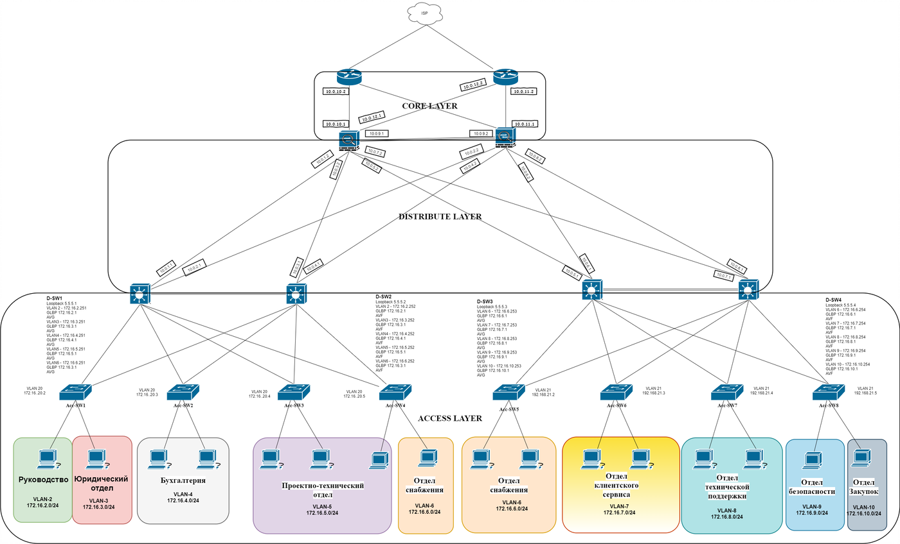

# «Организация сети офиса»

В этом файле я укажу настроенные конфигурации устройств , а темы как защита сети ,почему настраивал так или иначе буду разбивать на более мелкие файлы ,для удобства восприятия .

Разбиваем на части :

1. Адресация сети предприятия
2. OSPF и проверка связности
3. Создание VLAN , работа с HSRP и STP.
4.  DHCP , а также настройка L2 Security 
5. FTP , AAA server (Tacacs+) 