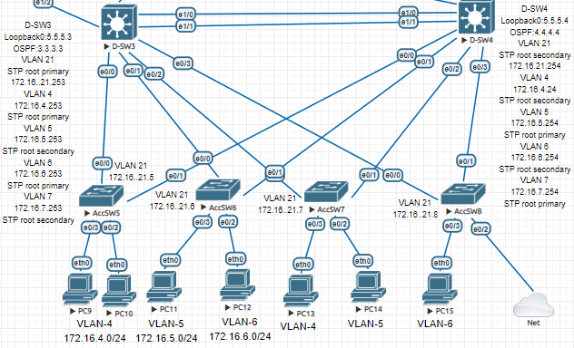

# «Организация сети офиса»


В этом файле я укажу настроенные конфигурации устройств , а темы как защита сети ,почему настраивал так или иначе буду разбивать на более мелкие файлы ,для удобства восприятия .

## Разбиваем на части :

1. Адресация сети предприятия
2. OSPF и проверка связности
3. Создание VLAN , работа с HSRP и STP.
4.  DHCP , а также настройка L2 Security 
5. FTP , AAA server (Tacacs+) 

### Адресация сети предприятия

Из частного диапазона адресов ,была выбрана:

**172.16.0.0/16**  и  **10.0.0.0/8**  ,чтобы избежать пересечения сетей ,когда будем в будещем настраивать удаленную работу сотрудникам предприятия.

При построении будущей модели предприятия , было решено строить 3х уровневую иерархическую модель предприятия , предложенная компанией  Cisco  : **Enterprise Campus Architecture** . 

Так как планируется, что 80% трафика будет задействованно внутри предприятия и 20% внешнего трафика .  А теперь разберем суть данной модели по уровням , начиная с нижнего.

**Access Layer** - подразумевает ,что на 1 устройство ляжет не более 5% от общего трафика всего предприятия в среднем.

**Distribution Layer** - подразумевает ,что на 1 устройство ляжет не более 20% от общего трафика всего предприятия в среднем.

**Core Layer** - подразумевает ,что на 1 устройство ляжет не более 80% от общего трафика всего предприятия в среднем.(но может и под 100% и это будет тоже нормально)

Далее ,трафик был поделен на 9 VLAN-ов 

2    ENGINEER
3    ACCOUNTING
4    LAWYER 
5    SKLAD
6    PROVISION
7    IT
20   MANAGEMENT
21   MANAGEMENT

А также 20 VLAN MANAGEMENT был добавлен ,когда разворачивал Windows Server в 3 distribution блоке.  Всю сеть предприятия можно поделить на  **3 блока**  Distribution, которые объеденены иерархически.

*Первый блок* : D-SW1 и D-SW2

*Второй блок*:  D-SW3 и D-SW4

*Третий блок* : FarmDistSW1 и FarmDistSW2

Всё что ниже этих устройств это L2 , всё что выше этих устройств  L3.

#### STP

Для первых 2х блоков и перехода в L3  использовался протокол резервирования первого перехода - **GLBP**. И первая проблема , с которой столкнулся , это STP , а точнее PVST , который строит дерево за каждый VLAN. Проблема том, что STP блокирует порты , и вследствии чего , трафик  идет через  Access коммутатор , нарушая идеалогию иерархического построения сети.

За первый блок D-SW1 и D-SW2 у нас 3 домена трафика : VLAN 2, 3, 20. (VLAN 2 и VLAN 3 для работы пользователей ,а 20 для управления устройствами.)

Это озночает ,что у нас будет 3 STP дерева ,которые должны строиться согласно иерархической идеологии. Именно поэтому мы обязаны вручную прописать Root Primary , а также Root Secondary .


Аналогисная ситуация складывается и во 2ом блоке ,где уже 5 STP деревьев нужно построить.




Укажу команды по данной настройке и для примера возьму **D-SW1**

**D-SW1**

```
Установим root за каждый Vlan 
D-SW1(config)#spanning-tree vlan 2 root primary 
D-SW1(config)#spanning-tree vlan 20 root primary 
D-SW1(config)#spanning-tree vlan 3 root secondary 

Также был организован Etherchannel ,чтобы трафик ходил иерархично + этим была организована отказоустойччивость

interface Ethernet1/0
 switchport trunk encapsulation dot1q
 channel-group 1 mode desirable
!         
interface Ethernet1/1
 switchport trunk encapsulation dot1q
 channel-group 1 mode desirable

interface Port-channel1
 switchport trunk encapsulation dot1q
 
port-channel load-balance src-dst-mac

Ограничивать конкретными Vlan не стал ,по причине того,что обычно доступ к D-SW ограничен помещением,который закрывается на ключ.
 
Настройка GLBP за каждый Vlan +  ip helper-address для направния запросов на DHCP сервер, который может находиться за несколько канальных сред.

interface Vlan2
 ip address 172.16.2.251 255.255.255.0
 ip helper-address 5.5.5.11
 glbp 0 ip 172.16.2.1
 glbp 0 priority 150
 glbp 0 preempt
 
 interface Vlan3
 ip address 172.16.3.251 255.255.255.0
 ip helper-address 5.5.5.11
 glbp 0 ip 172.16.3.1
 glbp 0 preempt
 
Также на каждом устройстве который учавствует в OSPF и работает с IP был назначен Loopback адрес:
 
interface Loopback0
  ip address 5.5.5.1 255.255.255.255 
```

Аналогичная настройка присутствует на остальных L3 Switch уровня Distribution.

### OSPF и проверка связности

Далее было прописан адрес на каждом интерфейсе Router  или Switch L3 в режиме роутера. И организован протокол динамической маршрутизации OSPF .

**D-SW1**

```
router ospf 1
 router-id 1.1.1.1
 network 5.5.5.1 0.0.0.0 area 0  
 network 10.0.1.0 0.0.0.3 area 0
 network 10.0.2.0 0.0.0.3 area 0
 network 172.16.2.0 0.0.0.255 area 0  
 network 172.16.3.0 0.0.0.255 area 0
 network 172.16.20.0 0.0.0.255 area 0

Также для более скорой сходимости сети ,если интерфейс упадет я уменьшил dead-interval до 20

interface Ethernet1/2
 no switchport
 ip address 10.0.1.1 255.255.255.252
 ip ospf dead-interval 20
 duplex auto
!         
interface Ethernet1/3
 no switchport
 ip address 10.0.2.1 255.255.255.252
 ip ospf dead-interval 20
 duplex auto
 
Я рассматривал добавление всторонней area в OSPF ,но отказался ,так как устройств в сети довольно мало .
```

На этом этапе была проведено тестирование оборудования на отказоустойчивость и на скорость сходимости в случае сбоя.

### DHCP и L2 Security


 **DHCP** 

```
Исключим из выдачи ip адресов шлюзы по умолчанию , а также адреса интерфейсов Vlan.

ip dhcp excluded-address 172.16.2.1
ip dhcp excluded-address 172.16.3.1
ip dhcp excluded-address 172.16.4.1
ip dhcp excluded-address 172.16.5.1
ip dhcp excluded-address 172.16.6.1
ip dhcp excluded-address 172.16.7.1
ip dhcp excluded-address 172.16.20.1 172.16.20.5
ip dhcp excluded-address 172.16.21.1
ip dhcp excluded-address 172.16.21.5 172.16.21.8
ip dhcp excluded-address 172.16.2.251 172.16.2.252
ip dhcp excluded-address 172.16.3.251 172.16.3.252
ip dhcp excluded-address 172.16.3.253 172.16.3.254
ip dhcp excluded-address 172.16.4.253 172.16.4.254
ip dhcp excluded-address 172.16.5.253 172.16.5.254
ip dhcp excluded-address 172.16.6.253 172.16.6.254
ip dhcp excluded-address 172.16.7.253 172.16.7.254
!         
ip dhcp pool VLAN2
 network 172.16.2.0 255.255.255.0
 default-router 172.16.2.1 
 dns-server 192.168.1.1 
!         
ip dhcp pool VLAN3
 network 172.16.3.0 255.255.255.0
 default-router 172.16.3.1 
 dns-server 192.168.1.1 
!         
ip dhcp pool VLAN4
 network 172.16.4.0 255.255.255.0
 default-router 172.16.4.1 
 dns-server 192.168.1.1 
!         
ip dhcp pool VLAN5
 network 172.16.5.0 255.255.255.0
 default-router 172.16.5.1 
 dns-server 192.168.1.1 
!         
ip dhcp pool VLAN6
 network 172.16.6.0 255.255.255.0
 default-router 172.16.6.1 
 dns-server 192.168.1.1 
!         
ip dhcp pool VLAN7
 network 172.16.7.0 255.255.255.0
 default-router 172.16.7.1 
 dns-server 192.168.1.1 
```

Проверим работу DHCP

```
VPCS> ip dhcp
DORA IP 172.16.2.2/24 GW 172.16.2.1

VPCS> show ip

NAME        : VPCS[1]
IP/MASK     : 172.16.2.2/24
GATEWAY     : 172.16.2.1
DNS         : 192.168.1.1  
DHCP SERVER : 10.0.19.1
DHCP LEASE  : 86394, 86400/43200/75600
MAC         : 00:50:79:66:68:1d
LPORT       : 20000
RHOST:PORT  : 127.0.0.1:30000
MTU         : 1500
```

Далее приступим к настройке коммутируемой среды::

1. Port-security
2. ~~Storm Control~~
3. DHCP SNooping 
4. ~~IP Source Guard~~
5. Dynamic ARP Inspection

К сожалению ,мне придется отказаться от некоторых технологий по причине не поддержки в данной прошивке устройства.

#### **Port-security**

Это функция коммутатора, позволяющая указать MAC-адреса хостов, которым разрешено передавать данные через порт.

**AccSW1**

```
interface Ethernet0/2
 switchport access vlan 2
 switchport mode access
 switchport port-security maximum 10
 switchport port-security mac-address sticky
 switchport port-security mac-address sticky 0050.7966.681e
 switchport port-security
!         
interface Ethernet0/3
 switchport access vlan 2
 switchport mode access
 switchport port-security maximum 10
 switchport port-security mac-address sticky
 switchport port-security mac-address sticky 0050.7966.681d
 switchport port-security
```

Данной настройкой указал максимальное количество устройств за портом и режим mac-address sticky указывает , что он самостоятельно будет учить эти адреса. Прописывается это безусловно *только на access портах* коммутаторов уровня доступа. 

#### **~~Storm Control~~**

Эта технология позволяет защититься от широковещательного шторма . Его принцип ,срезать такой трафик при его увеличении на определенный уровень загрузки порта или коммутатора. Настраивается *на всех портах* коммутатора.

К сожалению , данная технология не поддерживается на этих образах.

#### DHCP SNooping 

**AccSW1**

```
interface Ethernet0/0
 switchport trunk allowed vlan 2,20
 switchport trunk encapsulation dot1q
 switchport mode trunk
 ip dhcp snooping trust
         
interface Ethernet0/1
 switchport trunk allowed vlan 2,20
 switchport trunk encapsulation dot1q
 switchport mode trunk
 ip dhcp snooping trust
```

