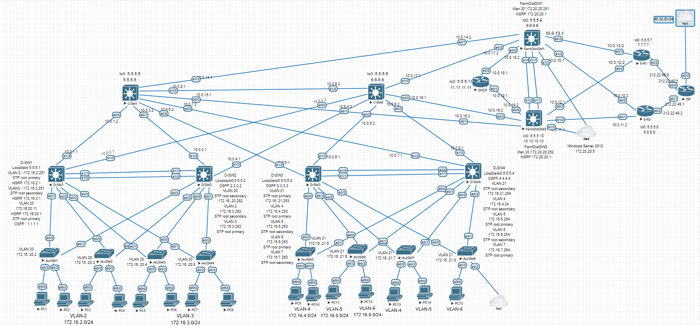

# «Организация сети офиса»

В этом файле я укажу настроенные конфигурации устройств , а темы как защита сети ,почему настраивал так или иначе буду разбивать на более мелкие файлы ,для удобства восприятия .

## Разбиваем на части :

1. Адресация сети предприятия
2. OSPF и проверка связности
3. Создание VLAN , работа с HSRP и STP.
4.  DHCP , а также настройка L2 Security 
5. FTP , AAA server (Tacacs+) 

### Адресация сети предприятия

Из частного диапазона адресов ,была выбрана:

**172.16.0.0/16**  и  **10.0.0.0/8**  ,чтобы избежать пересечения сетей ,когда будем в будещем настраивать удаленную работу сотрудникам предприятия.

При построении будущей модели предприятия , было решено строить 3х уровневую иерархическую модель предприятия , предложенная компанией  Cisco  : **Enterprise Campus Architecture** . 

Так как планируется, что 80% трафика будет задействованно внутри предприятия и 20% внешнего трафика .  А теперь разберем суть данной модели по уровням , начиная с нижнего.

**Access Layer** - подразумевает ,что на 1 устройство ляжет не более 5% от общего трафика всего предприятия в среднем.

**Distribution Layer** - подразумевает ,что на 1 устройство ляжет не более 20% от общего трафика всего предприятия в среднем.

**Core Layer** - подразумевает ,что на 1 устройство ляжет не более 80% от общего трафика всего предприятия в среднем.(но может и под 100% и это будет тоже нормально)

Далее ,трафик был поделен на 9 VLAN-ов 

2    ENGINEER
3    ACCOUNTING
4    LAWYER 
5    SKLAD
6    PROVISION
7    IT
20   MANAGEMENT
21   MANAGEMENT

А также 20 VLAN MANAGEMENT был добавлен ,когда разворачивал Windows Server в 3 distribution блоке.  Всю сеть предприятия можно поделить на  **3 блока**  Distribution, которые объеденены иерархически.

*Первый блок* : D-SW1 и D-SW2

*Второй блок*:  D-SW3 и D-SW4

*Третий блок* : FarmDistSW1 и FarmDistSW2

Всё что ниже этих устройств это L2 , всё что выше этих устройств  L3.

#### STP

Для первых 2х блоков и перехода в L3  использовался протокол резервирования первого перехода - **GLBP**. И первая проблема , с которой столкнулся , это STP , а точнее PVST , который строит дерево за каждый VLAN. Проблема том, что STP блокирует порты , и вследствии чего , трафик  идет через  Access коммутатор , нарушая идеалогию иерархического построения сети.

За первый блок D-SW1 и D-SW2 у нас 3 домена трафика : VLAN 2, 3, 20 .

Это озночает ,что у нас будет 3 STP дерева ,которые должны строиться согласно иерархической идеологии. Именно поэтому мы обязаны вручную прописать Root Primary , а также Root Secondary .

Аналогисная ситуация складывается и во 2ом блоке ,где уже 5 STP деревьев нужно построить.

Про 3-ий блок напишу позже ,когда будем качаться DHCP и также затронем поднятый Windows Server .