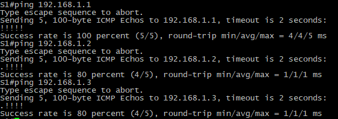
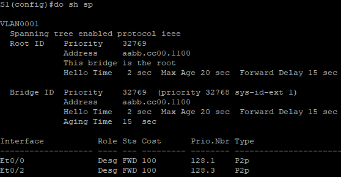
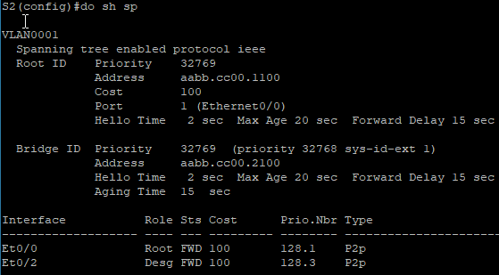
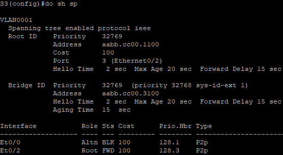
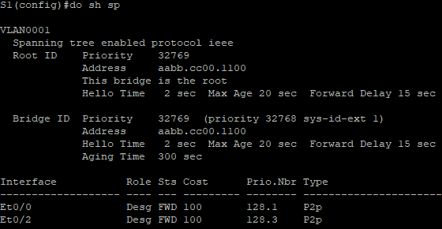
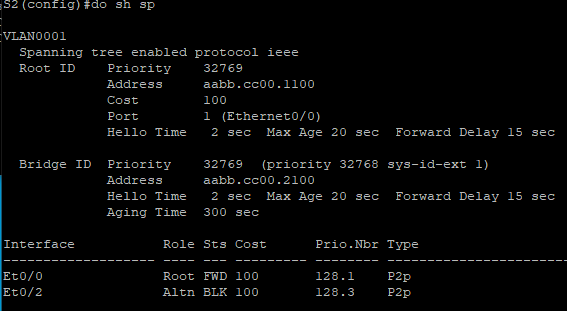
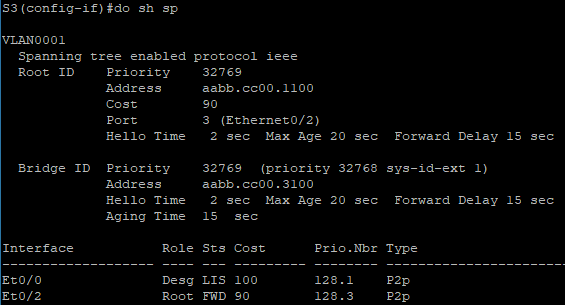
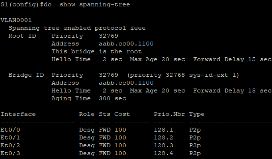
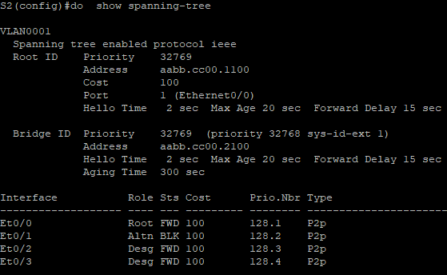
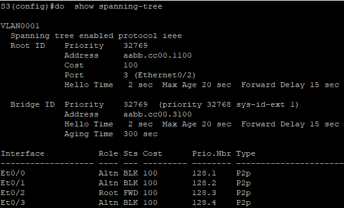

## Лабораторная работа. Развертывание коммутируемой сети с резервными каналами

### Топология

### Таблица адресации

| Устройство | Интерфейс | IP-адрес    | Маска подсети |
| ---------- | --------- | ----------- | ------------- |
| S1         | VLAN 1    | 192.168.1.1 | 255.255.255.0 |
| S2         | VLAN 1    | 192.168.1.2 | 255.255.255.0 |
| S3         | VLAN 1    | 192.168.1.3 | 255.255.255.0 |

### Цели

**Часть 1.** Создание сети и настройка основных параметров устройства

**Часть 2.** Выбор корневого моста

**Часть 3.** Наблюдение за процессом выбора протоколом STP порта, исходя из стоимости портов

**Часть 4.** Наблюдение за процессом выбора протоколом STP порта, исходя из приоритета портов

### Создание сети и настройка основных параметров устройства

Построили мы сеть согласно топологии , далее пропишем имена и устройств ,а также назначим IP на VLAN 1 интерфейсе.

**S1:** 
enable 
conf t
host S1
line con 0
exec-t 0 0
exit
int vlan 1
ip add 192.168.1.1 255.255.255.0
no shut  
**S2:** 
enable
conf t
host S2
line con 0
exec-t 0 0
exit
int vlan 1
ip add 192.168.1.2 255.255.255.0
no shut  
**S3:** 
enable
conf t 
host S3
line con 0
exec-t 0 0
exit
int vlan 1
ip add 192.168.1.3 255.255.255.0
no shut  

Далее отключим DNS поиск , а также назначим пароли на привилегированному режиму,а также на VTY консоли, logging synchronous для консольного канала.

**S1,S2,S3:** 
no ip domain-lookup
enable secret class
line vty 0 4
logging synchronous 
password cisco
login
exit
Banner motd "This is a secure system. Authorized Access Only!"

А также баннерное сообщение дня (MOTD) для предупреждения пользователей о запрете несанкционированного доступа.

end 
Copy run start
[Enter]

Проверим связь между свичами:

### Определение корневого моста

Настраиваем порты в режим **trunk**

conf t
int ran e0/0-3
sw tr en d
sw m tr

Отключаем лишние порты, пусть это будет e0/1 и e0/3

int e0/1
shut
int e0/3
shut
exit

Отображаем данные по STP

**S1,S2,S3:** do sh span

Теперь нагляднее :

звездочка красная это порт выключен ( disabled )

Root выбирается на основе MAC адреса и BID Priority(по умолчанию 32769), наименьший адрес устройства MAC побеждает в выборах.  Порт e0/0 на S3 был заблокирован STP и данные по нему не будут ходить.

###  Наблюдение за процессом выбора протоколом STP порта, исходя из стоимости портов

Так как информацию по STP и его портам мы имеем ,то сейчас мы будем наблюдать,как будет меняться топология исходя из стоимости портов. По умолчанию стоимость Ethernet = 100 ,посмотрим как измениться топология,когда мы на S3  изменим стоимость порта в сторону root.

**S3:**
int e0/2
spanning-tree cost 90
exit

Выведем состояние STP в порядке S1,S2,S3. 

Как видим порты поменялись местами . Теперь вернем как и было.

S3:
int e0/2
no spanning-tree cost 90
exit

###  Наблюдение за процессом выбора протоколом STP порта, исходя из приоритета портов

Включаем отключенные ранее порты на коммутаторах

int e0/1
no shut
int e0/3
no shut
exit

Проверим состояние STP сейчас 

**do  show spanning-tree**

Коммутатор S1 корневой,а это значит,что все его порты desg .
Также  видим, что каждый коммутатор в сторону корневого выбрал по 1 порту в качестве root на основе номера порта и его стоимости.  А также выделил альтернативный и заблокированный порт. 
Что касается направления S2 и S3 ,то там выбор desg и altn , чтобы не создавать петли.

1. Какое значение протокол STP использует первым после выбора корневого моста, чтобы определить выбор порта?

   Поиск портов в сторону коммутатора root, то есть кротчайшие пути,которые зависят от скорости соединения и количества промежуточных коммутаторов.

2. Если первое значение на двух портах одинаково, какое следующее значение будет использовать протокол STP при выборе порта?

   Если стоимости портов равны, процесс сравнивает BID. Если BID равны, для определения корневого моста используются приоритеты портов. Значение приоритета по умолчанию — 128,отключается порт с большим значением.

3. Если оба значения на двух портах равны, каким будет следующее значение, которое использует протокол STP при выборе порта?

    STP может принимать следующие  значения:  прослушивание (Listening), обучение (Learning), коммутация (Forwarding),  блокирование (Blocking). То есть если не получается коммутировать,то он порты блокирует,выбирая Altn порты.

