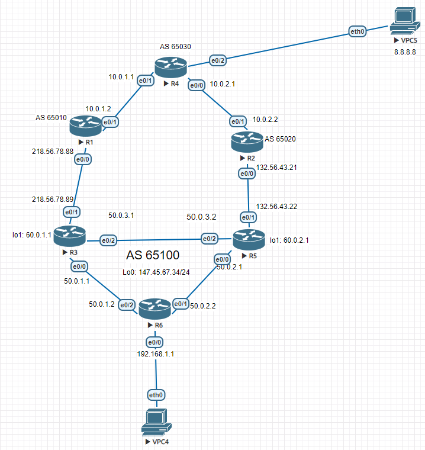

# Подключение к провайдеру по BGP 



## Конфигурации роутеров:

### R6

```
R6#show running-config
Building configuration...

Current configuration : 1193 bytes
!
version 12.4
service timestamps debug datetime msec
service timestamps log datetime msec
no service password-encryption
!
hostname R6
!
boot-start-marker
boot-end-marker
!
!
no aaa new-model
memory-size iomem 5
no ip icmp rate-limit unreachable
ip cef
!
!
!
!
no ip domain lookup
ip auth-proxy max-nodata-conns 3
ip admission max-nodata-conns 3
!
!
!
!
!
!
!
!
!
!
!
!
!
!
!
!
!
!
!
ip tcp synwait-time 5
ip ssh version 1
!
!
!
!
!
interface Ethernet0/0
 ip address 50.0.2.2 255.255.255.0
 duplex auto
 speed auto
!
interface Serial0/0
 no ip address
 shutdown
 clock rate 2000000
!
interface Ethernet0/1
 ip address 50.0.1.2 255.255.255.0
 duplex auto
 speed auto
!
interface Ethernet1/0
 ip address 192.168.1.1 255.255.255.0
 duplex auto
 speed auto
!
router ospf 1
 log-adjacency-changes
 network 50.0.0.0 0.0.255.255 area 0
 network 192.168.0.0 0.0.255.255 area 0
!
ip forward-protocol nd
!
!
no ip http server
no ip http secure-server
!
no cdp log mismatch duplex
!
!
!
control-plane
!
!
!
!
!
!
!
!
!
!
line con 0
 exec-timeout 0 0
 privilege level 15
 logging synchronous
line aux 0
 exec-timeout 0 0
 privilege level 15
 logging synchronous
line vty 0 4
 login
!
!
end

```

### R5

```
R5#show running-config
Building configuration...

Current configuration : 2401 bytes
!
version 12.4
service timestamps debug datetime msec
service timestamps log datetime msec
no service password-encryption
!
hostname R5
!
boot-start-marker
boot-end-marker
!
!
no aaa new-model
memory-size iomem 5
no ip icmp rate-limit unreachable
ip cef
!
!
!
!
no ip domain lookup
ip auth-proxy max-nodata-conns 3
ip admission max-nodata-conns 3
!
!
!
!
!
!
!
!
!
!
!
!
!
!
!
!
!
!
!
ip tcp synwait-time 5
ip ssh version 1
!
!
!
!
!
interface Loopback0
 ip address 147.45.67.34 255.255.255.0
!
interface Loopback1
 ip address 60.0.2.1 255.255.255.0
 ip nat inside
 ip virtual-reassembly
!
interface Ethernet0/0
 ip address 50.0.2.1 255.255.255.0
 ip nat inside
 ip virtual-reassembly
 duplex auto
 speed auto
!
interface Serial0/0
 no ip address
 shutdown
 clock rate 2000000
!
interface Ethernet0/1
 ip address 132.56.43.22 255.255.255.0
 ip nat outside
 ip virtual-reassembly
 duplex auto
 speed auto
!
interface Ethernet0/2
 ip address 50.0.3.2 255.255.255.0
 ip nat inside
 ip virtual-reassembly
 duplex auto
 speed auto
!
router ospf 1
 log-adjacency-changes
 network 50.0.0.0 0.0.255.255 area 0
 network 60.0.2.0 0.0.0.255 area 0
 default-information originate always metric 20
!
router bgp 65100
 no synchronization
 bgp router-id 7.7.7.7
 bgp log-neighbor-changes
 neighbor 60.0.1.1 remote-as 65100
 neighbor 60.0.1.1 update-source Loopback1
 neighbor 60.0.1.1 next-hop-self
 neighbor 60.0.1.1 weight 200
 neighbor 132.56.43.21 remote-as 65020
 neighbor 132.56.43.21 prefix-list 1 in
 neighbor 132.56.43.21 route-map ournets out
 neighbor 132.56.43.21 advertise-map ournets non-exist-map NONEXIST_MAP
 no auto-summary
!
ip forward-protocol nd
!
!
no ip http server
no ip http secure-server
ip nat pool NAT 147.45.67.34 147.45.67.34 netmask 255.255.255.0
ip nat inside source list 1 pool NAT overload
!
!
ip prefix-list 1 seq 5 permit 0.0.0.0/0
!
ip prefix-list NONEXIST seq 5 permit 1.2.3.0/24
!
ip prefix-list our-network seq 5 permit 147.45.67.0/24
access-list 1 permit 192.168.0.0 0.0.255.255
no cdp log mismatch duplex
!
route-map NONEXIST_MAP permit 10
 match ip address prefix-list NONEXIST
!
route-map ournets permit 100
 match ip address prefix-list our-network
!
!
!
control-plane
!
!
!
!
!
!
!
!
!
!
line con 0
 exec-timeout 0 0
 privilege level 15
 logging synchronous
line aux 0
 exec-timeout 0 0
 privilege level 15
 logging synchronous
line vty 0 4
 login
!
!
end

```

### R3

```
R3#show running-config
Building configuration...

Current configuration : 2084 bytes
!
version 12.4
service timestamps debug datetime msec
service timestamps log datetime msec
no service password-encryption
!
hostname R3
!
boot-start-marker
boot-end-marker
!
!
no aaa new-model
memory-size iomem 5
no ip icmp rate-limit unreachable
ip cef
!
!
!
!
no ip domain lookup
ip auth-proxy max-nodata-conns 3
ip admission max-nodata-conns 3
!
!
!
!
!
!
!
!
!
!
!
!
!
!
!
!
!
!
!
ip tcp synwait-time 5
ip ssh version 1
!
!
!
!
!
interface Loopback0
 ip address 147.45.67.34 255.255.255.0
!
interface Loopback1
 ip address 60.0.1.1 255.255.255.0
 ip nat inside
 ip virtual-reassembly
!
interface Ethernet0/0
 ip address 218.56.78.89 255.255.255.0
 ip nat outside
 ip virtual-reassembly
 duplex auto
 speed auto
!
interface Serial0/0
 no ip address
 shutdown
 clock rate 2000000
!
interface Ethernet0/1
 ip address 50.0.1.1 255.255.255.0
 ip nat inside
 ip virtual-reassembly
 duplex auto
 speed auto
!
interface Ethernet1/0
 ip address 50.0.3.1 255.255.255.0
 duplex auto
 speed auto
!
router ospf 1
 router-id 2.2.2.2
 log-adjacency-changes
 network 50.0.0.0 0.0.255.255 area 0
 network 60.0.1.0 0.0.0.255 area 0
 default-information originate always
!
router bgp 65100
 no synchronization
 bgp log-neighbor-changes
 network 147.45.67.0 mask 255.255.255.0
 timers bgp 5 20 20
 neighbor 60.0.2.1 remote-as 65100
 neighbor 60.0.2.1 update-source Loopback1
 neighbor 60.0.2.1 next-hop-self
 neighbor 218.56.78.88 remote-as 65010
 neighbor 218.56.78.88 weight 200
 neighbor 218.56.78.88 prefix-list 1 in
 no auto-summary
!
ip forward-protocol nd
!
!
no ip http server
no ip http secure-server
ip nat pool NAT 147.45.67.34 147.45.67.34 netmask 255.255.255.0
ip nat inside source list 1 pool NAT overload
!
!
ip prefix-list 1 seq 5 permit 0.0.0.0/0
ip prefix-list 1 seq 10 permit 1.2.3.0/24
access-list 1 permit 192.168.0.0 0.0.255.255
no cdp log mismatch duplex
!
!
!
control-plane
!
!
!
!
!
!
!
!
!
!
line con 0
 exec-timeout 0 0
 privilege level 15
 logging synchronous
line aux 0
 exec-timeout 0 0
 privilege level 15
 logging synchronous
line vty 0 4
 login
!
!
end

```

### R2

```
R2#show running-config
Building configuration...

Current configuration : 1606 bytes
!
version 12.4
service timestamps debug datetime msec
service timestamps log datetime msec
no service password-encryption
!
hostname R2
!
boot-start-marker
boot-end-marker
!
!
no aaa new-model
memory-size iomem 5
no ip icmp rate-limit unreachable
ip cef
!
!
!
!
no ip domain lookup
ip auth-proxy max-nodata-conns 3
ip admission max-nodata-conns 3
!
!
!
!
!
!
!
!
!
!
!
!
!
!
!
!
!
!
!
ip tcp synwait-time 5
ip ssh version 1
!
!
!
!
!
interface Loopback2
 ip address 167.34.23.5 255.255.255.0
!
interface Loopback3
 ip address 155.78.65.7 255.255.255.0
!
interface Ethernet0/0
 ip address 10.0.2.2 255.255.255.0
 duplex auto
 speed auto
!
interface Serial0/0
 no ip address
 shutdown
 clock rate 2000000
!
interface Ethernet0/1
 ip address 132.56.43.21 255.255.255.0
 duplex auto
 speed auto
!
interface Ethernet1/0
 no ip address
 shutdown
 duplex auto
 speed auto
!
router bgp 65020
 no synchronization
 bgp log-neighbor-changes
 network 0.0.0.0
 network 155.78.65.0 mask 255.255.255.0
 network 167.34.24.0 mask 255.255.255.0
 neighbor 10.0.2.1 remote-as 65030
 neighbor 10.0.2.1 route-map SET-ASPATH out
 neighbor 132.56.43.22 remote-as 65100
 no auto-summary
!
ip forward-protocol nd
ip route 0.0.0.0 0.0.0.0 Null0
!
!
no ip http server
no ip http secure-server
!
no cdp log mismatch duplex
!
route-map SET-ASPATH permit 10
 set as-path prepend 65020 65020 65020 65020 65020 65020
!
!
!
control-plane
!
!
!
!
!
!
!
!
!
!
line con 0
 exec-timeout 0 0
 privilege level 15
 logging synchronous
line aux 0
 exec-timeout 0 0
 privilege level 15
 logging synchronous
line vty 0 4
 login
!
!
end

```

### R1

```
R1#show running-config
Building configuration...

Current configuration : 1345 bytes
!
version 12.4
service timestamps debug datetime msec
service timestamps log datetime msec
no service password-encryption
!
hostname R1
!
boot-start-marker
boot-end-marker
!
!
no aaa new-model
memory-size iomem 5
no ip icmp rate-limit unreachable
ip cef
!
!
!
!
no ip domain lookup
ip auth-proxy max-nodata-conns 3
ip admission max-nodata-conns 3
!
!
!
!
!
!
!
!
!
!
!
!
!
!
!
!
!
!
!
ip tcp synwait-time 5
ip ssh version 1
!
!
!
!
!
interface Ethernet0/0
 ip address 218.56.78.88 255.255.255.0
 duplex auto
 speed auto
!
interface Serial0/0
 no ip address
 shutdown
 clock rate 2000000
!
interface Ethernet0/1
 ip address 10.0.1.2 255.255.255.0
 duplex auto
 speed auto
!
interface Ethernet1/0
 no ip address
 shutdown
 duplex auto
 speed auto
!
router bgp 65010
 no synchronization
 bgp log-neighbor-changes
 network 0.0.0.0
 network 1.2.3.0 mask 255.255.255.0
 neighbor 10.0.1.1 remote-as 65030
 neighbor 218.56.78.89 remote-as 65100
 no auto-summary
!
ip forward-protocol nd
ip route 0.0.0.0 0.0.0.0 Null0
ip route 1.2.3.0 255.255.255.0 Null0
!
!
no ip http server
no ip http secure-server
!
no cdp log mismatch duplex
!
!
!
control-plane
!
!
!
!
!
!
!
!
!
!
line con 0
 exec-timeout 0 0
 privilege level 15
 logging synchronous
line aux 0
 exec-timeout 0 0
 privilege level 15
 logging synchronous
line vty 0 4
 login
!
!
end

```

### R4

```
R4#show running-config
Building configuration...

Current configuration : 1349 bytes
!
version 12.4
service timestamps debug datetime msec
service timestamps log datetime msec
no service password-encryption
!
hostname R4
!
boot-start-marker
boot-end-marker
!
!
no aaa new-model
memory-size iomem 5
no ip icmp rate-limit unreachable
ip cef
!
!
!
!
no ip domain lookup
ip auth-proxy max-nodata-conns 3
ip admission max-nodata-conns 3
!
!
!
!
!
!
!
!
!
!
!
!
!
!
!
!
!
!
!
ip tcp synwait-time 5
ip ssh version 1
!
!
!
!
!
interface Ethernet0/0
 ip address 10.0.2.1 255.255.255.0
 duplex auto
 speed auto
!
interface Serial0/0
 no ip address
 shutdown
 clock rate 2000000
!
interface Ethernet0/1
 ip address 10.0.1.1 255.255.255.0
 duplex auto
 speed auto
!
interface Ethernet1/0
 ip address 8.8.8.1 255.255.255.0
 duplex auto
 speed auto
!
router bgp 65030
 no synchronization
 bgp log-neighbor-changes
 network 8.8.8.0 mask 255.255.255.0
 neighbor 10.0.1.2 remote-as 65010
 neighbor 10.0.2.2 remote-as 65020
 no auto-summary
!
ip forward-protocol nd
ip route 132.56.43.0 255.255.255.0 10.0.2.2
ip route 218.56.78.0 255.255.255.0 10.0.1.2
!
!
no ip http server
no ip http secure-server
!
no cdp log mismatch duplex
!
!
!
control-plane
!
!
!
!
!
!
!
!
!
!
line con 0
 exec-timeout 0 0
 privilege level 15
 logging synchronous
line aux 0
 exec-timeout 0 0
 privilege level 15
 logging synchronous
line vty 0 4
 login
!
!
end

```

**Выводы:**

Схема не идеальна,но показывает как можно создать подключение по BGP с резервированием ,а также отработать проблемы с NAT-ом ,которые возникают при анонсировании одинаковой сети в интернете. Вспомнил фильтрацию маршрутов , отработал команду **default-informarion originate always (metric 20)** .