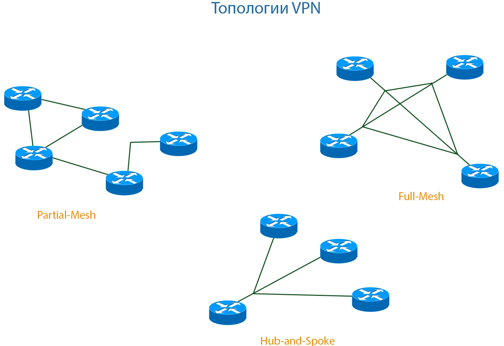
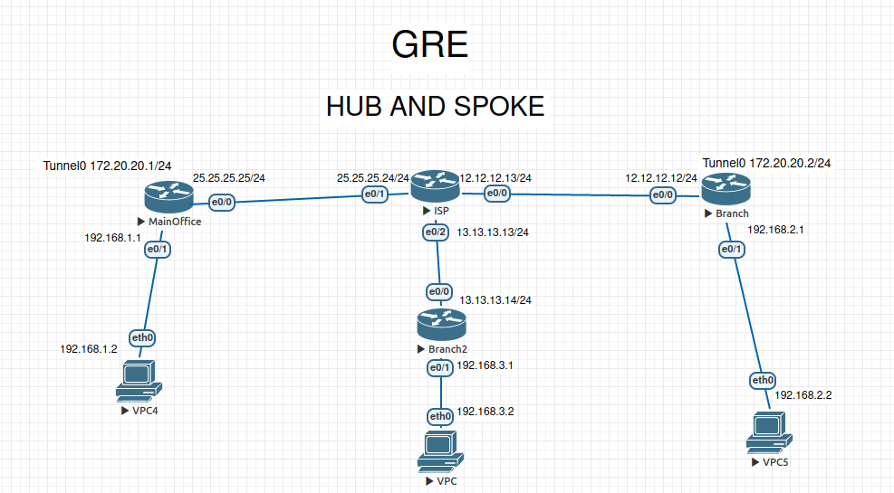

 

# GRE

Проблема GRE в том, что при увеличении количества удаленных филиалов, возрастает кратно создание туннелей каждый на каждого.



Основные 2 вида топологий Full-Mesh и Hub-and-Spoke. В данном примере хочу показать как настроить GRE по типу Hub-and-Spoke.



Далее укажу настройку:

### **MainOffice**

```
enable
configure terminal
!
hostname MainOffice
no ip domain lookup
!
interface Tunnel0
 ip address 172.20.20.1 255.255.255.0
 no ip route-cache
 keepalive 10 3
 tunnel source Ethernet0/0
 tunnel destination 12.12.12.12
 tunnel key 3
 tunnel sequence-datagrams
 tunnel checksum
!         
interface Tunnel1
 ip address 172.20.21.1 255.255.255.0
 no ip route-cache
 keepalive 10 3
 tunnel source Ethernet0/0
 tunnel destination 13.13.13.14
 tunnel key 3
 tunnel sequence-datagrams
 tunnel checksum
!         
interface Ethernet0/0
 ip address 25.25.25.25 255.255.255.0
 ip nat outside
 ip virtual-reassembly in
 duplex auto
!         
interface Ethernet0/1
 ip address 192.168.1.1 255.255.255.0
 ip nat inside
 ip virtual-reassembly in
 duplex auto
!
ip nat inside source list 1 interface Ethernet0/0 overload
ip route 0.0.0.0 0.0.0.0 25.25.25.24
ip route 192.168.2.0 255.255.255.0 Tunnel0
ip route 192.168.3.0 255.255.255.0 Tunnel1
!                  
access-list 1 permit 192.168.1.0 0.0.0.255
!
line con 0
 exec-timeout 0 0
 logging synchronous
end
!
wr
```

### **Branch**

```
enable
configure terminal
!
hostname Branch
no ip domain lookup
!
interface Tunnel0
 ip address 172.20.20.2 255.255.255.0
 no ip route-cache
 keepalive 10 3
 tunnel source Ethernet0/0
 tunnel destination 25.25.25.25
 tunnel key 3
 tunnel sequence-datagrams
 tunnel checksum
!
interface Ethernet0/0
 ip address 12.12.12.12 255.255.255.0
 ip nat outside
 ip virtual-reassembly in
 duplex auto
!
interface Ethernet0/1
 ip address 192.168.2.1 255.255.255.0
 ip nat inside
 ip virtual-reassembly in
 duplex auto
!
ip nat inside source list 1 interface Ethernet0/0 overload
ip route 0.0.0.0 0.0.0.0 12.12.12.13
ip route 192.168.1.0 255.255.255.0 Tunnel0
ip route 192.168.3.0 255.255.255.0 Tunnel0
!
access-list 1 permit 192.168.2.0 0.0.0.255
!
line con 0
 exec-timeout 0 0
 logging synchronous
!
end
wr
```

### **Branch**2

```
enable
configure terminal
!
hostname Branch2             
no ip domain lookup      
!         
interface Tunnel0
 ip address 172.20.21.2 255.255.255.0
 no ip route-cache
 keepalive 10 3
 tunnel source Ethernet0/0
 tunnel destination 25.25.25.25
 tunnel key 3
 tunnel sequence-datagrams
 tunnel checksum
!         
interface Ethernet0/0
 ip address 13.13.13.14 255.255.255.0
 ip nat outside
 ip virtual-reassembly in
 duplex auto
!         
interface Ethernet0/1
 ip address 192.168.3.1 255.255.255.0
 ip nat inside
 ip virtual-reassembly in
 duplex auto
!
ip nat inside source list 1 interface Ethernet0/0 overload
ip route 0.0.0.0 0.0.0.0 Ethernet0/0
ip route 192.168.1.0 255.255.255.0 Tunnel0
ip route 192.168.2.0 255.255.255.0 Tunnel0    
!
access-list 1 permit 192.168.3.0 0.0.0.255
!
line con 0
 exec-timeout 0 0
 logging synchronous
!
end
wr
```

### Итог:

Я указал как перенаправить трафик туннеля по средствам перенаправления его в главный роутер MainOffice, а он уже в свою очередь направляет этот трафик в другой филиал. Но проблема всё же не решается, так как при увеличении филиалов нагрузка на главный роутер будет возрастать. И с данной задачей уже справиться технология  **DMVPN**. 
