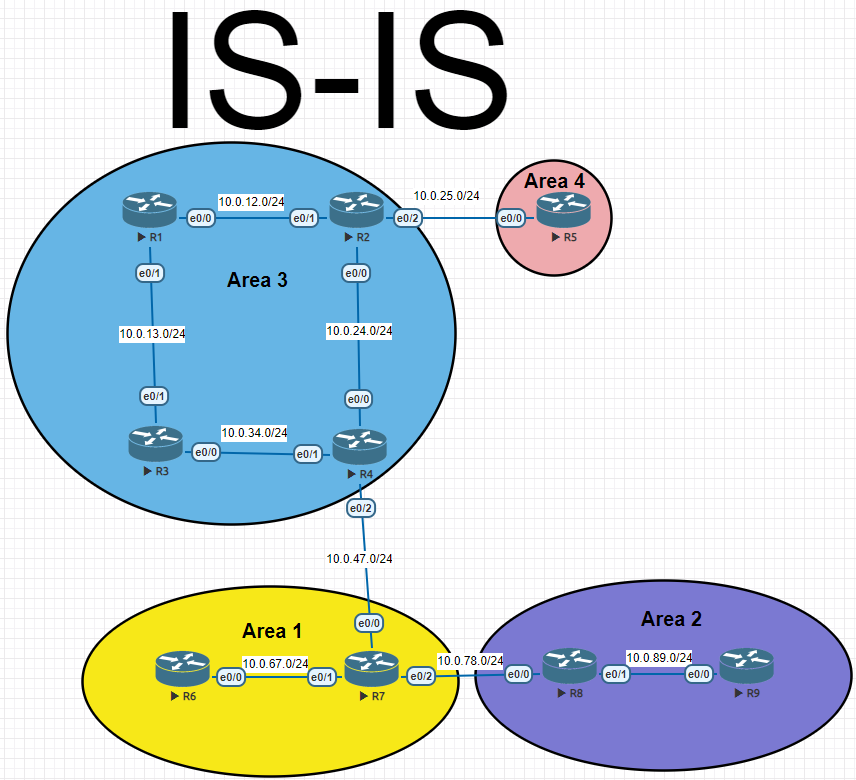

# Protocol IS-IS




 Эта схема показывает как можно настроить is-is без фильтрации ,то есть обычная связность без накидных механизмов и прочих прелестей управления трафиком.  

## Конфигурации устройств:

### R1

```
interface Ethernet0/0
 no shutdown
 ip address 10.0.12.1 255.255.255.0
 ip router isis 
!
interface Ethernet0/1
 no shutdown
 ip address 10.0.13.1 255.255.255.0
 ip router isis 
!
router isis
 net 49.0003.0000.0000.0001.00
 is-type level-1

```

### R2

```
interface Ethernet0/0
 no shutdown
 ip address 10.0.24.2 255.255.255.0
 ip router isis 
!
interface Ethernet0/1
 no shutdown
 ip address 10.0.12.2 255.255.255.0
 ip router isis 
 isis circuit-type level-1
!
interface Ethernet0/2
 no shutdown
 ip address 10.0.25.2 255.255.255.0
 ip router isis 
 isis circuit-type level-2-only
!
!
router isis
 net 49.0003.0000.0000.0002.00
```

### R3

```
interface Ethernet0/0
 no shutdown
 ip address 10.0.34.3 255.255.255.0
 ip router isis 
 isis circuit-type level-1
!
interface Ethernet0/1
 no shutdown
 ip address 10.0.13.3 255.255.255.0
 ip router isis 
 isis circuit-type level-1
!
!
router isis
 net 49.0003.0000.0000.0003.00
 is-type level-1
```

### R4

```

interface Ethernet0/0
 no shutdown
 ip address 10.0.24.4 255.255.255.0
 ip router isis 
!
interface Ethernet0/1
 no shutdown
 ip address 10.0.34.4 255.255.255.0
 ip router isis 
 isis circuit-type level-1
!
interface Ethernet0/2
 no shutdown
 ip address 10.0.47.4 255.255.255.0
 ip router isis 
 isis circuit-type level-2-only
!
router isis
 net 49.0003.0000.0000.0004.00
```

### R5

```
interface Ethernet0/0
 no shutdown
 ip address 10.0.25.5 255.255.255.0
 ip router isis 
 isis circuit-type level-2-only
!
!
router isis
 net 49.0004.0000.0000.0005.00
```

### R6

```
interface Ethernet0/0
 no shutdown
 ip address 10.0.67.6 255.255.255.0
 ip router isis 
 isis circuit-type level-1
!
!
router isis
 net 49.0001.0000.0000.0006.00
 is-type level-1
```

### R7

```
interface Ethernet0/0
 no shutdown
 ip address 10.0.47.7 255.255.255.0
 ip router isis 
 isis circuit-type level-2-only
!
interface Ethernet0/1
 no shutdown
 ip address 10.0.67.7 255.255.255.0
 ip router isis 
 isis circuit-type level-1
!
interface Ethernet0/2
 no shutdown
 ip address 10.0.78.7 255.255.255.0
 ip router isis 
 isis circuit-type level-2-only
!
router isis
 net 49.0001.0000.0000.0007.00
```

### R8

```
interface Ethernet0/0
 no shutdown
 ip address 10.0.78.8 255.255.255.0
 ip router isis 
 isis circuit-type level-2-only
!
interface Ethernet0/1
 no shutdown
 ip address 10.0.89.8 255.255.255.0
 ip router isis 
 isis circuit-type level-1
!
router isis
 net 49.0002.0000.0000.0008.00
```

### R9

```
interface Ethernet0/0
 no shutdown
 ip address 10.0.89.9 255.255.255.0
 ip router isis 
 isis circuit-type level-1
!
!
router isis
 net 49.0002.0000.0000.0009.00
```

