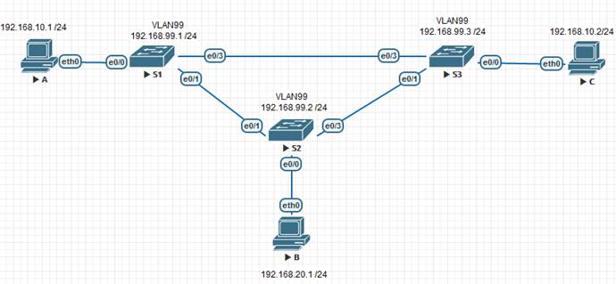
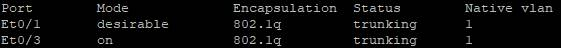
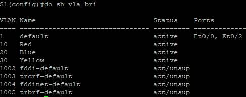
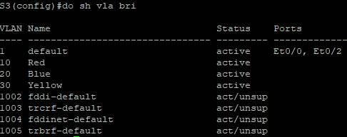
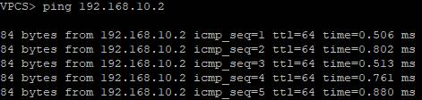
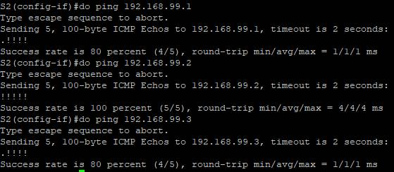

## Лабораторная работа. Настройка расширенных сетей VLAN, VTP и DTP

#### Топология

#### Таблица адресации

| Заголовок таблицы | Интерфейс | IP-адрес     | Маска подсети |
| ----------------- | --------- | ------------ | ------------- |
| S1                | VLAN 99   | 192.168.99.1 | 255.255.255.0 |
| S2                | VLAN 99   | 192.168.99.2 | 255.255.255.0 |
| S3                | VLAN 99   | 192.168.99.3 | 255.255.255.0 |
| PC-A              | NIC       | 192.168.10.1 | 255.255.255.0 |
| PC-B              | NIC       | 192.168.20.1 | 255.255.255.0 |
| PC-C              | NIC       | 192.168.10.2 | 255.255.255.0 |

 

#### **Домашнее задание**

##### VLAN

**Цель:** Настройка VTP Настройка DTP Добавление сетей VLAN и назначение портов Настройка расширенной сети VLAN 

В этой лабораторной работе вы настроите магистральные каналы между этими коммутаторами
 Все коммутаторы будут настроены на использование VTP для обновлений сетей VLAN. S2 будет настроен в качестве сервера. 
 Настройка динамического протокола транкинга (DTP)
 Добавление сетей VLAN и назначение портов
 В 4 части вам предстоит перевести VTP на коммутаторе S1 в прозрачный режим и создать сеть VLAN расширенного диапазона на коммутаторе S1.

#### Создание сети и настройка основных параметров устройства:

1.  Создать сеть согласно топологии(уже соединил согсно схеме)
    
     **S1 :** Enable – Configure terminal – interface vlan 1 – ip address 192.168.1.1 255.255.255.0 – no shutdown – exit - hostname S1 – do copy run start – [Enter] 
**S2 :** Enable – Configure terminal – interface vlan 1 – ip address 192.168.1.2 255.255.255.0 – no shutdown – exit -  Hostname S2 – do copy run start – [Enter]
    **S3 :** Enable – Configure terminal – interface vlan 1 – ip address 192.168.1.3 255.255.255.0 – no shutdown – exit - Hostname S3 – do copy run start – [Enter]
    
2.  Чтобы отключить поиск по DNS на каждом коммутаторе прописываем
    no ip domain-lookup в режиме конфигурации

3.  В режиме конфигурации пропишем : пароль на расширенный режим, и на вход устройства ,а также синхронизацию CLI . 
    **S1 :** enable secret class – line console 0 – password cisco – login - logging synchronous
     **S2 :** enable secret class – line console 0 – password cisco – login - logging synchronous 
     **S3 :** enable secret class – line console 0 – password cisco – login - logging synchronous

4.  Настроим баннер при входе, при входе на устройство 
    **S1,S2,S3:** Banner motd “**This is a secure system. Authorized Access Only!”**

5.  Заводим протокол VTP на коммутаторы
    **S1 :** vtp domain CCNA – vtp password cisco – vtp version 3 – vtp mode client 
    **S2 :** vtp domain CCNA – vtp password cisco – vtp version 3 – vtp mode server – end – vtp primary server force
    **S3 :** vtp domain CCNA – vtp password cisco – vtp version 3 – vtp mode client

6.  Переведем порты в режим TRUNK для того,чтобы работал протокол VTP
    **S1 :** interface  FastEthernet 0/3– switchport trunk encapsulation dot1q – switchport mode trunk
    **S1:** interface FastEthernet 0/1 – switchport trunk encapsulation dot1q – switchport mode dynamic desirable – do show interface trunk vtp
    
    **S2 :** interface FastEthernet 0/1 – switchport trunk encapsulation dot1q – switchport mode trunk
    **S2 :** interface FastEthernet 0/3 – switchport trunk encapsulation dot1q – switchport mode trunk
    **S3:** interface FastEthernet 0/3 – switchport trunk encapsulation dot1q – switchport mode trunk
    **S3:** interface FastEthernet 0/1 – switchport trunk encapsulation dot1q – switchport mode trunk

7.  В **S2** заведем VLAN

     

    **S2:** vlan 999 – name VTP_Lab – : vlan 10 – name Red – vlan 20 – name Blue –vlan 30 –name Yellow – vlan 99 –name Management  
    
    Проверяем на остальных коммутаторах :
    S1: do show vlan brief

    

   S3: : do show vlan brief
    

8. Проверим утилитой  ping  связанность ПК A-C

   

   

   

 Со  Switch 2 проверим связанность со всеми коммутаторами
 

